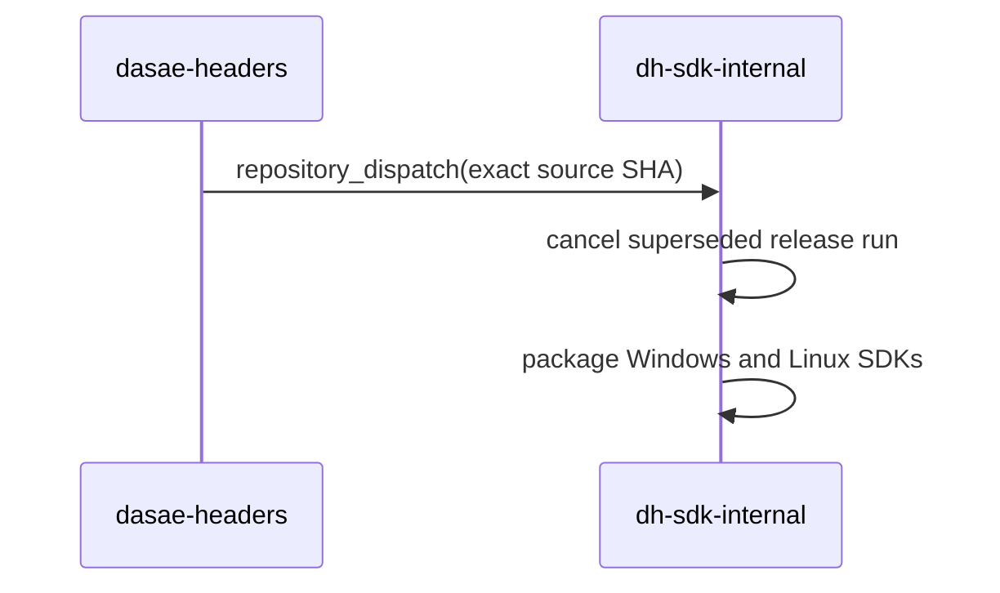

# Build - `dh-c` Guide

`dh-c` is a direct-source and project build tool for dasae-headers. Its usage
model combines direct compiler-style input with optional workspace/project
configuration files:

```bash
dh-c build main.c
dh-c build main.c util.c
dh-c build
dh-c test
dh-c package release
```

The command line and selected sources always remain first-class build input.
`project.dh` is optional for direct builds.

## Start here

Create a minimal named project or a workspace boundary without hand-writing the
first file:

```bash
dh-c project app
dh-c workspace .
```

Both commands refuse to overwrite an existing `project.dh` or `workspace.dh`.
The generated project is immediately buildable.

```bash
dh-c --help
dh-c help files
dh-c help build
dh-c help project-dh
dh-c help dh-file
dh-c help precedence
dh-c help invocation-only
```

The canonical file format is
[`dh-c/docs/dh-c-configuration-files.md`](./dh-c/docs/dh-c-configuration-files.md).

## 1. Direct builds

```bash
dh-c build main.c
dh-c build main.c util.c
dh-c run main.c
dh-c test test-main.c
```

For each selected source, `dh-c` automatically loads a same-stem companion:

```txt
main.c -> main.dh
util.c -> util.dh
```

Without a named `project.dh`, the first selected source is the build-unit owner.
Its companion may declare dependencies and `dh-c update main.c` generates
`main.lock.dh` beside it. Secondary companions remain flat overlays.

An explicit reusable overlay may be added with:

```bash
dh-c build main.c --dh-file=windows-runtime.dh
```

`--dh-file` is not `--dh`; `--dh` overrides the DH installation path.

## 2. Named projects

```txt
my-project/
├── project.dh
├── src/
├── include/
├── tests/
├── samples/
└── examples/
```

Minimal `project.dh`:

```ini
output=my-project
kind=executable
std=c17
```

```bash
dh-c build
dh-c run
dh-c test
```

`dh-c` detects the nearest ancestor `project.dh`, stopping at a discovered
`workspace.dh` boundary.

## 3. Configuration files

| File                           | Role                                                                                         |
| ------------------------------ | -------------------------------------------------------------------------------------------- |
| `workspace.dh`                 | shared flat defaults and workspace cache/discovery boundary                                  |
| `project.dh`                   | complete project, target-root, and dependency configuration                                  |
| `target.dh`                    | one resolved directory target's flat defaults                                                |
| `<source>.dh`                  | one selected source's companion; the primary projectless companion may also own dependencies |
| `--dh-file` input              | explicit reusable flat overlay                                                               |
| `lock.dh` / `<source>.lock.dh` | generated exact dependency resolution                                                        |
| `manifest.dh`                  | generated prebuilt compatibility metadata                                                    |

Merge order:

```txt
built-in/profile
-> workspace.dh
-> project.dh
-> target.dh
-> selected source companions
-> explicit --dh-file overlays
-> CLI
```

Authored `.dh` files are strict. Unknown keys and illegal sections fail.

## Configuration versus invocation controls

The `.dh` files store reusable compiler, linker, runtime, target, output,
optimization, dependency, and version settings. Scheduling and one-off command
selection stay on the command line: jobs, progress/verbosity, run arguments,
dry-run/clean scopes, sample/test selection, and analysis/emit requests.

```bash
dh-c help invocation-only
```

## 4. Everyday commands

### Build

```bash
dh-c build [profile] [path] [options]
```

Common forms:

```bash
dh-c build
dh-c build release
dh-c build main.c util.c
dh-c build --example demo
dh-c build --sample
dh-c build --example
dh-c build --lib --shared
dh-c build --image firmware.c --link-script=layout.ld
```

When `--sample` or `--example` is used without a member name or explicit source,
the command is a batch operation over the selected built-in root:

- each source file directly under the root becomes one executable;
- each immediate subdirectory becomes one executable containing its recursively
  discovered source files;
- empty subdirectories and non-source files are ignored.

The same batch selection applies to `build`, `run`, and `test`; each selected
executable is processed independently.

### Run

```bash
dh-c run [profile] [path] [options]
```

### Test

```bash
dh-c test [profile] [path] [options]
```

When omitted, `test` and `test-dsl` use the `test` profile. An explicitly
selected profile such as `release` takes precedence.

Test output separates result and timing:

```txt
[TEST]
  status: PASS
  exit: 0
  executable: ...
  elapsed: 0.012s
[TIMING]
  setup: 1.20s
    project library: 0.80s
    executable: 0.38s
  execution: 0.01s
Finished `test` in 1.21s
```

### Clean and prune

```bash
dh-c clean
dh-c clean --cache --older-than=30d --dry-run
dh-c clean --deps --unused --dry-run
dh-c clean --deps --older-than=90d
dh-c clean --deps --unused --force
```

Git dependency checkouts with user changes are preserved unless `--force` is explicit.
Untracked `build/`, `.dh-c/`, package staging, and dependency-export state created by dh-c
do not make an otherwise clean checkout look user-modified. `lock.dh` is never removed
by dependency cleanup. After cleanup, dh-c removes `.dh-c` when no state remains inside it.

## 5. Inspection commands

```bash
dh-c plan [profile] [path]
dh-c explain rebuild [profile] [path]
dh-c target show
dh-c doctor
dh-c toolchain all
dh-c compile-db
dh-c syntax
dh-c tidy
dh-c format
```

`plan` and `explain rebuild` are read-only. They do not build dependencies,
write caches or build descriptions, acquire project build-state paths, or create
`build/native`.

`syntax` uses a dependency-aware cache under the active target/profile build
tree. The cache key includes the effective compiler invocation, target, profile,
and source. Clang-generated `.d` files extend freshness checks to included
headers. A cache hit is reported as:

```txt
[SKIP] syntax path/to/source.c
```

Normal builds leave source/header freshness to Make. `dh-c` regenerates the
plan only when its build contract changes and does not pre-parse every object
dependency file before invoking Make. The more expensive read-only freshness
walk remains available to `plan` and `explain rebuild`.

`build --emit-disasm[=<path>]` invokes `llvm-objdump -d` after linking. Section
contents are enabled by default (`-s`) unless
`--disasm-section-contents=off` is explicit, so data sections present in the
artifact—including ELF `.rodata` and PE/COFF `.rdata`—are emitted alongside the
instruction disassembly.

## 6. Profiles

| Profile    | Intended use                                             |
| ---------- | -------------------------------------------------------- |
| `dev`      | debug iteration; default                                 |
| `fast`     | fastest compile path                                     |
| `test`     | test-focused optimization/debug balance                  |
| `profile`  | profiling build                                          |
| `stable`   | stable optimized build with ThinLTO policy               |
| `release`  | release optimization and reduced unwind/exception policy |
| `optimize` | maximum native optimization                              |
| `compact`  | size optimization                                        |
| `micro`    | extreme size optimization                                |

Use `dh-c help profiles` or `dh-c help --all` for the current exact flags.

## 7. Link and runtime model

These controls are independent build facts:

```ini
freestanding=on
link-libc=off
link-default-libs=off
link-start-files=off
link-compiler-rt=auto
link-stdlib=off
link-crt=off
```

`freestanding` changes compilation semantics only.

`link-stdlib=off` disables compiler-driver startup files and default libraries,
but explicit inputs remain:

```ini
link-stdlib=off
link=msvcrt
link=user32
define=COMP_HAS_LIBC
define=COMP_HAS_STDLIB
```

This supports compiler/platform runtimes, glibc or musl target settings,
custom runtimes, and fully user-authored startup/runtime code. Cache keys record
the effective compile and link commands. Prebuilt manifests compare
public ABI facts rather than requiring every consumer to repeat a producer's
private top-level link list. LTO artifacts additionally require a compatible
compiler toolchain identity.

## 8. Library and prebuilt behavior

A project with:

```ini
kind=lib
output=core
```

builds the full library set in every profile. Effective LTO determines whether
an additional LTO static archive is present; shared/static production itself is
not restricted to stable/release.

The profile directory contains one generated `manifest.dh` that inventories the
library artifacts. Test/sample/example executables do not overwrite it.

Host builds also provide:

```txt
build/native -> build/<normalized-host-target>
```

as a symbolic link or Windows junction where supported. Explicit cross-target
builds do not move the native alias.

An explicit target triple controls artifact naming and linker policy even when
the host OS differs. For example, a Windows-hosted build targeting
`x86_64-linux-gnu` is normalized to `x86_64-pc-linux-gnu` and produces Linux
`.a`/`.so` artifacts rather than `.lib`/`.dll` artifacts. GNU Windows targets
are normalized to the `*-w64-windows-gnu` form, while MSVC targets use
`*-pc-windows-msvc`.

`package --layout=prebuilt` is the immutable **library package** layout described
below. It requires a generated library `manifest.dh`.

The `dh-c` project additionally supports a relocatable, source-free SDK bundle:

```bash
cd dh-c
dh-c package release --layout=self-prebuilt
dh-c package release --layout=self-prebuilt --self-profiles=dev,test,release
```

The command profile (`release` above) selects how the bundled `dh-c` executable
is built. `--self-profiles` independently selects the DH library profiles made
available to projects using that executable. When omitted, it defaults to
`dev,fast,test,stable,release`.

The resulting SDK root is:

```txt
dh-c/self-prebuilt/<normalized-target>/<dh-c-profile>/
  sdk.dh
  LICENSE                         # when present in the source repository
  bin/
    dh-c[.exe]
    <required runtime DLLs>
  include/
    dh.h
    dh-main.h
    dh-TEST-main.h
    ...
  prebuilt/
    <normalized-target>/
      <selected DH profile>/
        manifest.dh
        libs/
        deps/                     # when required
```

The bundle is relocatable as one directory. Its `bin/dh-c` finds the SDK root
through its executable location after explicit `--dh`, current-directory
search, and `DH_HOME`. Creating it requires a source DH installation; consuming
it does not require DH or dh-c sources.

See:

- [`dh-c/docs/dh-c-prebuilt-manifest.md`](./dh-c/docs/dh-c-prebuilt-manifest.md)
- [`dh-c/docs/dh-c-prebuilt-package-format.md`](./dh-c/docs/dh-c-prebuilt-package-format.md)

## 9. Dependencies

Declare dependencies in root `project.dh`, or in the primary source companion of
a projectless build unit:

```ini
[SDL]
source=https://github.com/libsdl-org/SDL.git
revision=release-3.2.0
provider=cmake
linking=shared
prebuilt=auto
runtime-file=bin/SDL3.dll
```

Named-project commands:

```bash
dh-c fetch
dh-c update
dh-c status
dh-c deps
```

Projectless source-unit commands:

```bash
dh-c update main.c
dh-c fetch main.c
dh-c status main.c
dh-c deps main.c
dh-c graph main.c
dh-c build main.c util.c
```

`lock.dh` lives beside `project.dh`; `<source>.lock.dh` lives beside the primary
projectless source. `fetch` preserves an existing resolution and `update`
intentionally changes it. `graph` supports both scopes; `package` and `install`
remain named-project operations.

Provider cross-target inputs include compiler, archiver, target, sysroot,
and provider-specific toolchain variables where applicable.

Dependency staging preserves native and LTO static archives, shared libraries,
and import libraries. Windows consumers accept both MSVC `.lib` and GNU `.a` /
`.dll.a` forms. Dependency runtime DLLs staged under `lib/deps/` are copied into
the package `bin/` directory and retained by `install`. Dependency-generated
`.dh-exports` files carry exported compile constants, including version
constants, into normal builds, `syntax`, and `compile_commands.json`.

See [`dh-c/docs/external-dependencies.md`](./dh-c/docs/external-dependencies.md).

## 10. Generated state and source control

Normally tracked:

```txt
workspace.dh
project.dh
target.dh
*.dh source companions
lock.dh
*.lock.dh projectless source locks
source and public assets
```

Normally ignored:

```txt
build/
.dh-c/
package/        # generated install-layout staging
prebuilt/       # immutable library package output unless deliberately vendored
self-prebuilt/  # generated relocatable dh-c SDK roots
dist/           # generated release/archive output
```

Generated paths are lazy. A dependency-free build or package does not create
`lib/`, `lib/deps/`, or `.dh-c/deps/`. Project build serialization uses a lock
under the global dh-c cache rather than `.dh-c/build.lock`; an obsolete local
lock is removed, and an otherwise empty `.dh-c/` directory is removed with it.

When PCH is disabled, unavailable, unused by the selected source set, or already
fresh, the progress stream reports the reason with `[SKIP] PCH ...`. No PCH
output path or build rule is emitted when no PCH is required.

`manifest.dh` belongs inside generated build/prebuilt packages, not as a
hand-authored root project file.

## 11. SDK release dispatch

Pushes to `main` or `redesign-exec-model` dispatch the exact source commit to
`coding-pelican/dh-sdk-internal` only when `dh/include`, `dh/src`,
`dh-c/include`, or `dh-c/src` changes. Configure the source repository secret
`DH_SDK_DISPATCH_TOKEN` with permission to trigger Actions in that repository.
The SDK workflow owns cancellation of superseded runs and release publication.
It may archive the directory produced by `package --layout=self-prebuilt`; the
command itself deliberately creates a directory rather than assuming a release
archive format or transport.



## 12. Complete references

- [`dh-c/docs/dh-c-configuration-files.md`](./dh-c/docs/dh-c-configuration-files.md)
- [`dh-c/docs/dh-c-build-map.md`](./dh-c/docs/dh-c-build-map.md)
- [`dh-c/docs/external-dependencies.md`](./dh-c/docs/external-dependencies.md)
- [`dh-c/docs/external-tool-paths.md`](./dh-c/docs/external-tool-paths.md)
- [`dh-c/docs/dh-c-prebuilt-manifest.md`](./dh-c/docs/dh-c-prebuilt-manifest.md)
- [`dh-c/docs/dh-c-prebuilt-package-format.md`](./dh-c/docs/dh-c-prebuilt-package-format.md)
- `dh-c help --all`
