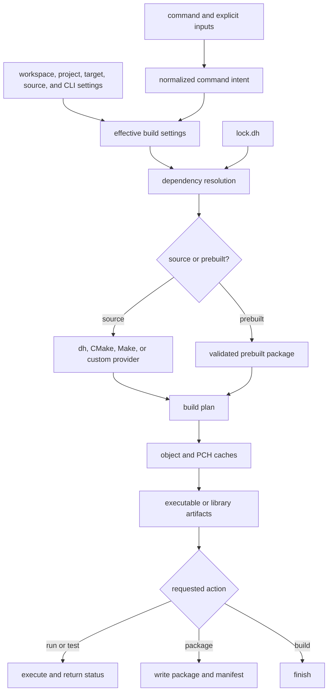
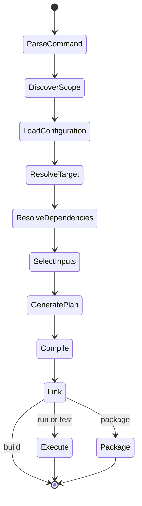
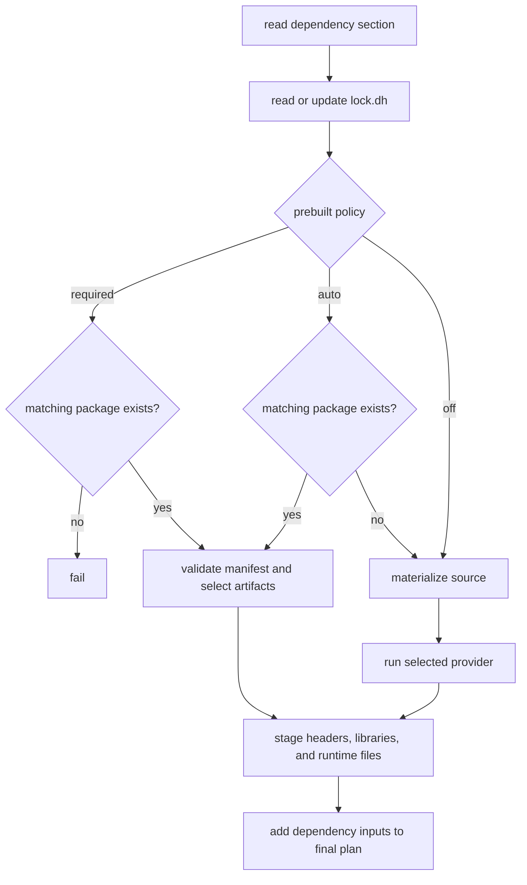

# `dh-c` Build Map

This document explains how `dh-c` turns a command and `.dh` files into
artifacts. Command usage belongs in [`BUILD.md`](../../BUILD.md); configuration
syntax belongs in
[`dh-c-configuration-files.md`](./dh-c-configuration-files.md).

## Big Picture

## Build State

## Dependency And Prebuilt Flow

## Normalized Intent
`dh-c` lowers command payloads through `dal_c_CommandIntent`.

Owner:
- `dh-c/src/dal-c/Cmd.c`
- `dh-c/src/dal-c/internal.h`

Normalized fields:
- action
- target path
- target-root hint
- output path override
- run args
- build-all
- recursive
- debug
- dsl-first
- cache-only
- library linking

Cross-module rule:
- `Cmd.c` owns command-surface interpretation.
- `build.c` consumes normalized intent and must not reinterpret raw payload unions.

## Artifacts And Outputs
Owner:
- `dh-c/src/dal-c/build.c`

Rules:
- profile root remains `build/<profile>/`
- declared target roots own their own context folder under `build/<profile>/`
- built-in compatibility roots still map to `samples`, `examples`, and `tests`
- plain project builds still fall back to `build/<profile>/targets/...`
- target-root outputs preserve enough relative path structure to avoid sibling collisions
- explicit output overrides still win

Why:
- build and run share the same target-root-aware output policy
- folder targets under the same root retain enough path information to avoid collisions

## Makefile And Stale Detection
Owner:
- `dh-c/src/dal-c/build.c`

Rules:
- Makefiles are plan-scoped under `build/<profile>/.plans/<context>/`
- object files are shared under `build/<profile>/obj/`, with native-static, LTO-static, and shared compilation receiving distinct object hashes
- generated makefiles are rewritten only when content changes
- generated unity/test-runner sources are rewritten only when content changes
- object paths are keyed by a compile-settings hash, not by the active plan file
- plan files do not own object freshness; source dependencies do

Compile-settings hash inputs:
- profile
- compiler and compile options
- include and define sets
- `compiler_args`
- PCH usage
- test-mode usage
- third-party warning mode

Why:
- switching between `sample`, `example`, `test`, `run`, or dependency builds preserves unrelated objects
- repeated `run` reaches `make: Nothing to be done for 'all'.`

## Self Reuse
Owner:
- `dh-c/src/dal-c/Cmd.c`
- `dh-c/src/dal-c/build.c`
- `dh-c/src/dal-c/Project.c`

Rules:
- reusable self code is declared by repeated `self-root=<path>`
- when no `self-root` is declared, the resolved project `src` root remains the default
- target roots declare whether they `link-project`
- self-project reuse builds cached native and LTO static variants from the self roots when the profile enables LTO
- target-root plans then compile only target-local sources and select the cached native or LTO self unit according to the final link settings
- `dh` self-project sample/test paths select `dh.lib`/`libdh.a` or `dh.lto.lib`/`libdh.lto.a` directly and skip a second local-project-lib path
- third-party dependency staging still belongs only to `lib/deps`

Why:
- sibling targets can share one cached self unit without pretending it is a third-party dependency
- `lib/deps` contains external dependencies rather than self-project reuse

## Library Artifacts
Owner:
- `dh-c/src/dal-c/Cmd.c`
- `dh-c/src/dal-c/build.c`

Rules:
- a static-library build always emits a native non-LTO archive
- when effective LTO is enabled, the same build also emits a `.lto` archive using that LTO mode
- a shared-library build emits one native DLL/SO after applying the effective profile LTO internally
- Windows shared outputs use `<name>.dll.lib` as the import-library name
- `kind=lib` composes the static variants and shared output rather than creating a new profile
- final links select `.lto` archives only when their own effective LTO is enabled
- dependency staging preserves both static variants and shared/import artifacts
- final static links order declared project dependencies by a stable consumer-before-provider topological traversal
- a dependency shared by multiple consumers is emitted once after all of those consumers
- the DH runtime archive is emitted after DH-based project and dependency archives

Names:
- Windows: `mylib.lib`, `mylib.lto.lib`, `mylib.dll`, `mylib.dll.lib`
- Linux: `libmylib.a`, `libmylib.lto.a`, `libmylib.so`

Why:
- profiles describe optimization/debug policy while artifact names describe the consumable representation
- native consumers remain compatible without LTO, while LTO consumers retain cross-module optimization
- DLL import libraries no longer collide with native static-library names

## Packaged Prebuilts
Owner:
- `dh-c/src/dal-c/Project.c`
- `dh-c/src/dal-c/Cmd.c`
- `dh-c/src/dal-c/build.c`

Rules:
- packaged artifacts live under `<project>/prebuilt/<normalized-target>/<profile>/`, never under the mutable `build/` cache
- `libs/` contains the project artifact and `deps/` may contain its transitive staged dependencies
- `prebuilt=auto` prefers a complete package and falls back to source
- `prebuilt=off` forces source traversal
- `prebuilt=required` fails when the matching package is absent
- the policy is accepted at project scope, command scope, and inside an individual dependency block
- an explicitly configured `auto` is tracked separately from an inherited default, allowing one dependency to override a project-wide `off` policy
- ordinary project tests may consume prebuilt dependencies; recursively requested dependency tests require source
- `dh`, self/static artifacts, and normal dependency links use the same native-versus-LTO selection rule
- PCH files are not consumed from SDK prebuilt packages
- `manifest.dh` inventories every artifact in the profile `libs/` directory; test/sample/example executables never overwrite it
- target, profile, selected artifact role/path, compiled ABI identity, LTO toolchain identity, and Windows import-library pairing are validated before use

Why:
- CI can test the current project without rebuilding unchanged dependency graphs
- individual dependencies can remain source-built when debugging while others use SDK packages
- immutable SDK inputs cannot silently hide changes in a source checkout

## PCH Policy
Owner:
- `dh-c/src/dal-c/Project.c`
- `dh-c/src/dal-c/build.c`
- project `project.dh`

Rules:
- `pch=auto` means detect by project convention
- `pch=off` disables PCH
- `pch=<path>` pins an explicit header
- `pch-exclude=<header>` declares headers that force no-PCH translation units when included by a source
- projects that only use `dh` through DSL use the detected `dh/include/dh-bundle.h` as PCH
- `lib/deps.h` is generated only when dependency headers exist or `pch=deps` explicitly requests it
- generated `lib/deps.h` includes only top-level headers under `lib/deps`
- `dh/project.dh` declares:
  - `pch=dh.h`
  - `pch-exclude=dh-main.h`
  - `pch-exclude=dh-TEST-main.h`

Why:
- PCH exclusion is now project policy, not hardcoded source-name heuristics
- `dh` self-build uses the same PCH framework as other projects

## libdh And Self Build
Owner:
- `dh-c/src/dal-c/build.c`

Rules:
- `dal_c__ensureLibDH()` detects the real `dh` project instead of constructing ad hoc temporary settings
- self-build uses the same plan-scoped makefile generation
- self-build uses the same object cache and PCH policy as normal builds

## Command Surface Matrix
Owner:
- `dh-c/include/dal-c.h`
- `dh-c/src/dal-c/Cmd.c`

Command surfaces:
- `build`: direct source build, project self build, declared target-root build, sample/example/test shorthands, `--dsl`, `--recur`
- `run`: same artifact policy as `build`, then execute/debug
- `test`: test runner or standalone test build, then execute/debug
- `build-dsl`: build `dh` only
- `test-dsl`: build/run `dh/tests` directly
- `clean`: build/cache cleanup with optional `--dsl` and `--recur`
- `clean-dsl`: DSL-only cleanup, `--cache` only

## Target-scoped Artifact Layout

- Build artifacts: `build/<normalized-target>/<profile>/...`
- Prebuilt artifacts: `prebuilt/<normalized-target>/<profile>/...`
- Implicit host target: resolved from the selected compiler (`--print-target-triple`, then `-dumpmachine`)
- Convenience alias: `build/native` points to the current host-target directory when the platform permits directory links
- Explicit `--target=<triple>` never resolves through `native`; it uses the normalized triple directly.

## Test Process

The DH test root main returns `0` only when the framework reports zero failed tests. Any failed unit returns a non-zero process status and is propagated by `dh-c test`.
