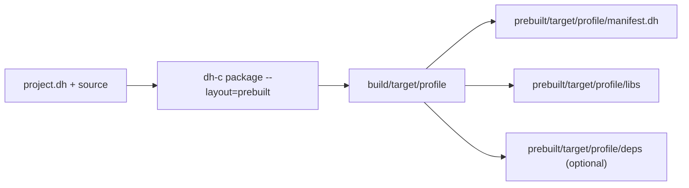

# dh-c Prebuilt Package Format

## Purpose

Prebuilt packages are immutable SDK inputs rather than ordinary `build/` cache
entries. `dh-c` uses the library package format for DH itself and dependencies
declared in `project.dh`. The `dh-c` project can also assemble those packages,
its executable, and public headers into one relocatable **self-prebuilt SDK**.

## Library package layout

A platform-specific DH or dependency library package uses:

```txt
<project>/
  include/
  prebuilt/
    <normalized-target>/
      dev/
        manifest.dh
        libs/
        deps/
      fast/
        manifest.dh
        libs/
        deps/
      test/
        manifest.dh
        libs/
        deps/
      stable/
        manifest.dh
        libs/
        deps/
      release/
        manifest.dh
        libs/
        deps/
```

Target directory names use canonical toolchain triples. For Linux GNU targets,
dh-c canonicalizes the non-semantic `unknown` vendor to `pc`, so
`x86_64-linux-gnu` and compiler-reported `x86_64-unknown-linux-gnu` resolve
`x86_64-pc-linux-gnu`. GNU Windows targets use `*-w64-windows-gnu`; MSVC targets
use `*-pc-windows-msvc`. Non-GNU ABI/vendor components are not rewritten merely
for display.

`libs/` contains the package's own artifacts. `deps/` is optional and contains
transitive headers, link artifacts, and `.dh-exports` compile-constant metadata
in the same relative layout that would otherwise be staged under `lib/deps/`.
For install-layout packages, dependency runtime DLLs are copied into `bin/`;
internal linker response files such as `.rsp` are not distributable artifacts.

Artifact names follow the normal library layout:

| Platform     | Native static             | LTO static       | Shared        | Import library                    |
| ------------ | ------------------------- | ---------------- | ------------- | --------------------------------- |
| Windows MSVC | `mylib.lib`               | `mylib.lto.lib`  | `mylib.dll`   | `mylib.dll.lib`                   |
| Windows GNU  | `libmylib.a` or `mylib.a` | `libmylib.lto.a` | `mylib.dll`   | `libmylib.dll.a` or `mylib.dll.a` |
| Linux        | `libmylib.a`              | `libmylib.lto.a` | `libmylib.so` | —                                 |

Every `kind=lib` profile contains the native static archive and shared artifact; Windows additionally contains the import library. Profiles with effective LTO also contain the `.lto` static archive so native and LTO consumers can select independently.

## Selection Modes

```txt
prebuilt=auto
prebuilt=off
prebuilt=required
```

- `auto` is the default. It uses a complete package when available and otherwise builds source.
- `off` always traverses and builds source.
- `required` rejects a missing package instead of silently building source.

The same values are accepted through `--prebuilt=<mode>`. A bare `--prebuilt` means `required`.

## Per-Dependency Selection

```txt
prebuilt=off

[fmt]
path=../fmt
linking=static
prebuilt=auto

[crypto]
path=../crypto
linking=shared
prebuilt=required
```

Here the project normally source-builds dependencies, `fmt` optionally consumes its package, and `crypto` must consume its shared package. Dependency-local policy is intentionally selectable independently from the project default.

## Tests And CI

A normal `dh-c test` may consume prebuilt dependencies. This lets CI rebuild only the current project and its test runner.

When dependency tests are explicitly requested with recursive testing or `test=true`, `dh-c` requires source for that dependency. A prebuilt library alone cannot represent or execute the dependency project's own tests.

## Package Boundaries

The current lookup assumes a platform-specific SDK archive: Windows and Linux packages should be distributed separately. LTO archives remain tied to the compatible compiler/LTO toolchain used by that SDK. Native archives and DLL/SO outputs are the compatibility fallback.

## Recommended SDK Profile Set

The artifact family does not change by profile:

- native static archive: every profile
- shared library: every profile
- Windows import library: every profile
- LTO static archive: profiles whose effective LTO mode is enabled

Profiles still select optimization, diagnostics, assertions, unwind, and LTO
policy. They do not silently redefine `kind=lib` into static-only output.
A producer may choose which profile directories to distribute, but any shipped
`kind=lib` profile follows the same artifact-family rules.

Header-only projects use `kind=lib` with an `include/` tree and no C sources.
They can be built and staged with the normal install package layout for every
profile, but they do not produce target-specific binary prebuilts or an empty
`manifest.dh`.

## Artifact manifest

Every target/profile directory must contain `manifest.dh`. dh-c rejects a missing,
malformed, unknown-key, or incompatible manifest before using the packaged artifact.
There is no legacy package fallback and no manifest format/version selector.

## Producer command

Run the package command once for each distributable profile:

```bash
dh-c package dev --layout=prebuilt
dh-c package fast --layout=prebuilt
dh-c package test --layout=prebuilt
dh-c package stable --layout=prebuilt
dh-c package release --layout=prebuilt
```

Each command builds the selected **library** profile and replaces only its
`prebuilt/<normalized-target>/<profile>/` package. A complete generated
`manifest.dh` and `libs/` inventory are required. Producer object files, plans,
and other mutable build state remain under `build/` and are not distributed.


See [dh-c-prebuilt-manifest.md](dh-c-prebuilt-manifest.md).

## Self-prebuilt dh-c SDK

Run this command from the `dh-c` project:

```bash
dh-c package release --layout=self-prebuilt
dh-c package release --layout=self-prebuilt --self-profiles=dev,test,release
```

The ordinary command profile controls the bundled `dh-c` executable. The
comma-separated `--self-profiles` list controls which DH profiles consumers can
select from the SDK. Its default is:

```txt
dev,fast,test,stable,release
```

Profile names must be valid and unique. `--self-profiles` is rejected for other
package layouts. The self-prebuilt layout is accepted only for an executable
project whose output is `dh-c`, and the producer must have a source DH
installation available.

The generated root is replaced atomically at:

```txt
<dh-c-project>/self-prebuilt/<normalized-target>/<dh-c-profile>/
```

Its contract is:

```txt
<sdk>/
  sdk.dh
  LICENSE                         # optional
  bin/
    dh-c[.exe]
    <runtime DLLs required by dh-c>
  include/
    dh.h
    dh-main.h
    dh-TEST-main.h
    dh-bundle.h
    dh/
      ...
  prebuilt/
    <normalized-target>/
      <selected-profile>/
        manifest.dh
        libs/
        deps/                     # optional
```

For each selected DH profile, the producer invokes a source build with
`prebuilt=off`, then promotes its complete library package. It forwards the
selected compiler, target, target architecture/tune/ABI, sysroot, job count,
and progress/command presentation settings. The normal install package is used
as the source of `bin/`, so runtime DLL delivery follows the same rules as
ordinary packaging. POSIX executable permissions are preserved while copying.

`sdk.dh` currently records:

```ini
sdk-format=1
layout=self-prebuilt
dh-version=<version>
dh-c-version=<version>
platform=<platform>
architecture=<architecture>
target=<normalized-target>
targets=<normalized-target>
dh-c-profile=<profile>
profiles=<comma-separated DH profiles>
```

A bundled `bin/dh-c` discovers the SDK root from its own executable path. The
lookup order remains:

1. explicit `--dh=<path>`
2. DH root found from the current directory and its parents
3. `DH_HOME`
4. the executable directory, its `dh/` child, then the parent SDK root and its
   `dh/` child

Consequently the entire SDK directory can be moved or extracted elsewhere and
used without source paths embedded in its layout. The producer command creates
a directory, not a `.zip` or `.tar.*`; release automation may archive that
root in the platform-specific format it owns.
