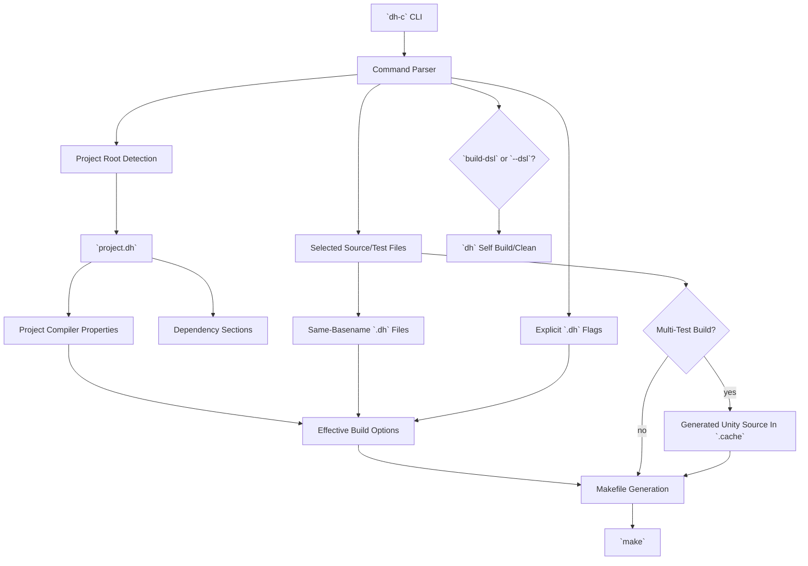
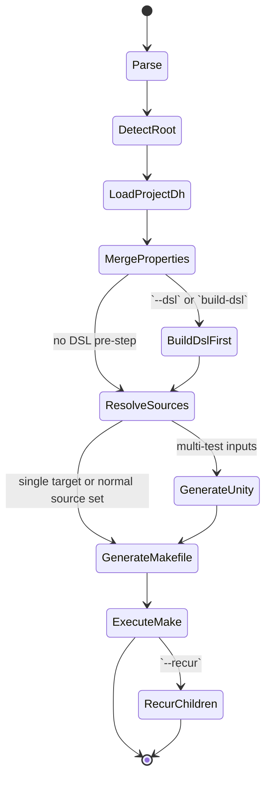
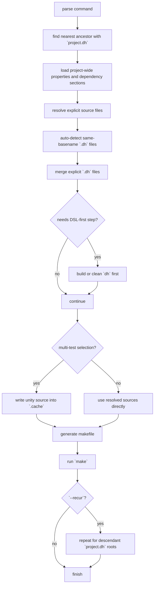

# `dh-c` DSL And Project Flow

## Phase

### Activity: Command And Project Model

#### Step: Replace `lib.dh` Root Detection With `project.dh`

Task `dsl-project-root`
- parent_step: `Replace lib.dh root detection with project.dh`
- depends_on: none
- input: `dh-c` command parser, project detector, legacy `lib.dh` parser
- deliverable: `project.dh`-driven project detection and dependency parsing
- acceptance_criteria:
  - project root is the nearest ancestor that contains `project.dh`
  - `project.dh` replaces `lib.dh` as the project metadata file
  - root-level compiler properties and dependency sections are both readable
- status: `in_progress`

#### Step: Add DSL-First Build Entry Points

Task `dsl-command-surface`
- parent_step: `Add DSL-first build entry points`
- depends_on: `dsl-project-root`
- input: command actions and build/clean options
- deliverable: `build-dsl`, `clean-dsl`, `build --dsl`, `clean --dsl`, `build --recur`, `clean --recur`
- acceptance_criteria:
  - `build-dsl` builds `dh/{include|src}` only
  - `clean-dsl` cleans generated artifacts for `dh`
  - `--dsl` runs the DSL operation before the project operation
  - `--recur` traverses descendant `project.dh` projects
- status: `in_progress`

### Activity: Source And Test Resolution

#### Step: Merge `.dh` Build Properties

Task `dsl-property-merge`
- parent_step: `Merge .dh build properties`
- depends_on: `dsl-project-root`
- input: project config, same-basename source properties, explicit property-file flags
- deliverable: merged compiler options for the effective build step
- acceptance_criteria:
  - `project.dh` contributes project-wide defaults
  - `foo.c` automatically picks up `foo.dh` when present
  - explicit `.dh` files can be added from the command line
- status: `in_progress`

#### Step: Support Multi-Test Unity Builds

Task `dsl-test-unity`
- parent_step: `Support multi-test unity builds`
- depends_on: `dsl-property-merge`
- input: selected test files and project `src/`
- deliverable: generated unity source for multi-test builds
- acceptance_criteria:
  - a single selected test file builds like a normal sample-style target
  - multiple selected test files build through one generated translation unit
  - project `src/` is still linked into test builds
- status: `in_progress`

## Big Picture

## State Machine

## Flow

