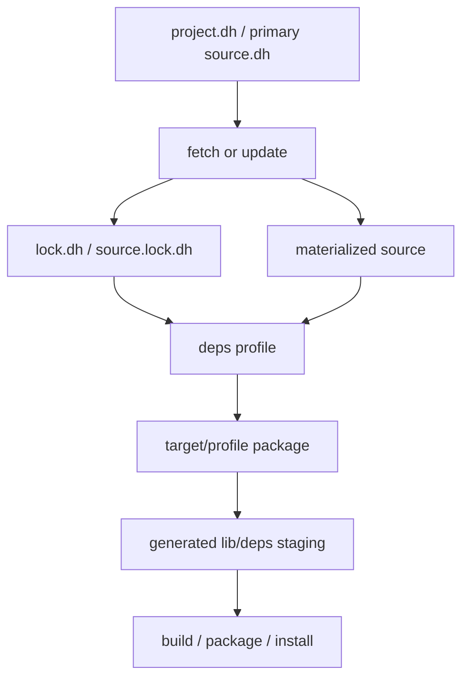
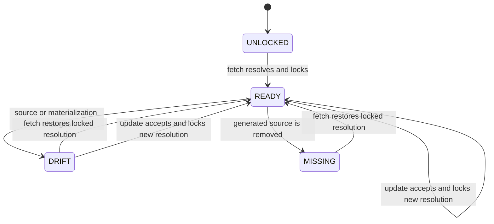
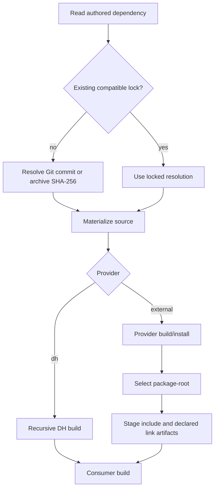

# External dependency contract

`dh-c` separates requested dependency state, resolved dependency state, mutable
source/provider state, and staged package output.

Named project scope:

```text
<project>/
  project.dh
  lock.dh
  .dh-c/
    deps/
      src/<name>/
      build/<target>/<profile>/<name>/
      packages/<target>/<profile>/<name>/
      usage/<name>.stamp
```

Projectless source-unit scope:

```text
<unit>/
  main.c
  main.dh
  main.lock.dh

<workspace>/.dh-c/units/<unit-id>/deps/   # when workspace.dh is found
<global-cache>/units/<unit-id>/deps/      # otherwise
```



The authored request and generated lock deliberately live at the same durable
scope level:

- `project.dh` or the primary projectless `<source>.dh` contains the requested
  local path, Git source/revision, or archive location together with its provider.
- `lock.dh` or `<source>.lock.dh` contains the exact resolved Git commit or
  archive SHA-256.
- `.dh-c/` and global cache trees contain disposable mutable state and must not
  own the persistent lock.

A dependency section may declare a Git source:

```ini
[SDL]
source=https://github.com/libsdl-org/SDL.git
revision=release-3.2.0
provider=cmake
```

or a directly downloadable archive, including a GitHub Release asset:

```ini
[SDL]
archive=https://github.com/libsdl-org/SDL/releases/download/release-3.2.0/SDL3-devel-3.2.0-mingw.zip
package-root=x86_64-w64-mingw32
provider=prebuilt
linking=shared
link=SDL3
```

Supported fields:

- `path=`: local source, a single header, or a package root.
- `source=`: Git URL or local Git repository.
- `archive=`: `.zip` or supported `.tar*` URL, or a local archive path.
- `package-root=`: safe relative package path inside a materialized prebuilt source.
- `revision=`: tag, commit, or branch for `source=` dependencies.
- `provider=dh|cmake|make|custom|prebuilt`.
- `build-command=` and `install-command=` for custom or overridden make workflows.

Header-only dependencies remain first-class inputs. A dependency may be a single
header or a directory with public headers and no compilation sources; `dh-c deps`
stages those headers without inventing a binary artifact.

`source=` and `archive=` are mutually exclusive. `revision=` is a Git request
and is rejected beside `archive=`; the exact archive SHA-256 is generated into
`lock.dh` instead. `package-root=` is accepted only by `provider=prebuilt` and
cannot be absolute or contain a `..` path segment.

Commands for a named project:

```sh
dh-c status
dh-c fetch
dh-c update
dh-c deps [profile] [build options]
```

Commands for a projectless source unit:

```sh
dh-c status main.c
dh-c fetch main.c
dh-c update main.c
dh-c deps main.c [profile] [build options]
dh-c graph main.c [--format=dot]
dh-c build main.c util.c
```

For a multi-source projectless unit, the first source is the dependency and lock
owner. Only that primary companion may contain dependency sections; secondary
companions and `--dh-file` overlays remain flat.

## Resolution policy

`fetch`, `update`, and `status` operate on dependencies declared by the nearest
`project.dh`, or by the primary `<source>.dh` explicitly selected on the command
line when no project owns the invocation.

- `fetch` reuses an existing compatible `lock.dh` entry. Git dependencies are
  checked out at the locked commit; archive dependencies reuse or reconstruct
  the locked SHA-256 materialization. A new entry is resolved only when none exists.
- `update` deliberately re-resolves the requested Git revision or downloads the
  current archive bytes and rewrites `lock.dh`.
- `status` compares each checkout/materialization with `lock.dh` and reports
  `READY`, `DRIFT`, or `UNLOCKED`.
- provider build/install requires remote dependency state to match `lock.dh`.
- changing a dependency source, archive, or provider invalidates the old entry;
  use `dh-c update` to replace the resolution.

The dependency lock is persistent source state and should normally be committed.
For projectless units this means committing `<source>.lock.dh`. The `.dh-c/` and
global cache trees are generated state and should be ignored.

Successful `fetch`, `update`, dependency build, and dependency install operations
update `.dh-c/deps/usage/<name>.stamp`. The stamp is disposable generated state;
it exists only so age-based maintenance reflects actual use rather than the age of
a checkout's internal Git files. Older layouts without a stamp fall back to the
newest modification time found in the dependency source/build/package state.





## Generated dependency maintenance

Dependency cleanup remains part of the canonical `clean` command:

```sh
# Preview dependency state that is no longer declared by project.dh.
dh-c clean --deps --unused --dry-run

# Remove undeclared dependency source/build/package state.
dh-c clean --deps --unused

# Remove dependency state not used in the last 90 days.
dh-c clean --deps --older-than=90d

# Apply both filters: only undeclared entries that are also old.
dh-c clean --deps --unused --older-than=90d
```

`--unused` compares generated dependency names with the current `project.dh` or
primary projectless source companion.
`--older-than` accepts an integer followed by `s`, `m`, `h`, `d`, or `w`; an
omitted suffix means seconds. When both filters are supplied, both conditions
must match.

Git checkouts with tracked changes or ordinary user-created files are preserved and
make cleanup fail visibly. Untracked `build/`, `.dh-c/`, `.cache/`, `package/`, and
`lib/deps/` entries created by dh-c are ignored by the dirty-checkout guard. Use
`--force` only when genuine local changes are intentionally disposable. Cleanup
never rewrites `lock.dh`: generated state and resolved project input are separate
ownership domains. Run `dh-c update` later when the dependency contract itself
should change.

## Workspace and cache scope

A discovered `workspace.dh` is a strict flat defaults file, a project-discovery
boundary, and the preferred shared build-cache scope. Workspace properties are
merged before each descendant `project.dh`:

```text
<workspace>/.dh-c/cache/
```

Projects and projectless source units in that workspace can reuse
build/PCH/source-list cache entries. Mutable dependency checkouts remain under
each owning scope:

```text
<project>/.dh-c/deps/
<workspace>/.dh-c/units/<unit-id>/deps/
```

This prevents two projects with the same dependency name but different locked
revisions from sharing one mutable checkout. Cross-project/global reuse of
immutable dependency contents can later be content-addressed; it must not be
implemented by aliasing mutable source trees.

When no workspace is found, project builds use their project cache. Projectless
source units use an isolated `<global-cache>/units/<unit-id>` state root while
keeping `<source>.lock.dh` beside the source owner.

## Provider execution

### CMake

During `dh-c deps`, CMake dependencies are configured and built out-of-source.
`dh-c package`/provider installation privately installs them with
`CMAKE_INSTALL_PREFIX` set to the dependency package directory.

The configure contract forwards the effective compiler, archiver, target triple,
and sysroot through `CMAKE_C_COMPILER`, `CMAKE_AR`,
`CMAKE_C_COMPILER_TARGET`, and `CMAKE_SYSROOT`. If
`DH_DEP_CMAKE_TOOLCHAIN_FILE` is set, it is forwarded as
`CMAKE_TOOLCHAIN_FILE`.

Profile mapping:

- `dev`, `test` -> `Debug`
- `stable` -> `RelWithDebInfo`
- `release`, `optimize`, `fast` -> `Release`
- `compact`, `micro` -> `MinSizeRel`

### Make

The default build runs `make` from the dependency source directory. Installation
runs `make install PREFIX=<package>` there. `build-command=` or
`install-command=` overrides the respective command. The process receives the
same effective target environment as custom providers, including `CC`, `AR`,
and `CFLAGS`.

### Custom

`build-command=` is required. `install-command=` is optional. Commands execute
from the source directory with these environment variables:

```text
DH_DEP_SOURCE
DH_DEP_BUILD
DH_DEP_PACKAGE
DH_DEP_PROFILE
DH_DEP_TARGET
DH_DEP_CC
DH_DEP_AR
DH_DEP_SYSROOT
DH_DEP_CFLAGS
CC
AR
CFLAGS
```

### Prebuilt

`path=` identifies an existing package root, while `archive=` may fetch one.
The root uses the normal `include/`, `lib/`, and optional `bin/` package layout.
Build/install performs no compilation: it materializes the root into the private
target/profile package directory and then uses the same staging path as every
other external provider. When an archive or Git checkout wraps that layout,
`package-root=` selects its relative location. If `link=` entries are present,
only their `linking=static|shared` variants are staged; otherwise all recognized
library artifacts under `lib/` are staged.

## Archive acquisition

`archive=` is intentionally not a provider. The downloaded directory may still
be consumed by `dh`, `cmake`, `make`, `custom`, or `prebuilt`.

Supported suffixes are `.zip`, `.tar`, `.tar.gz`, `.tgz`, `.tar.xz`, `.txz`,
`.tar.bz2`, `.tbz2`, `.tar.zst`, and `.tzst`. `dh-c` uses `curl` and falls back
to `wget` for remote downloads. Extraction uses `tar`; `.zip` also falls back to
`unzip`. A local archive path is copied directly without a downloader.

The generated lock records the archive location and `revision=sha256:<hex>`.
`fetch` never accepts different bytes for an existing lock. If the materialized
source is missing, it downloads the archive again and verifies the locked hash
before replacing generated state. `update` is the only command that accepts new
bytes and writes their new SHA-256. Archives with exactly one top-level directory
are unwrapped automatically; multi-root archives retain their extracted root.

### dh

Fetched `provider=dh` projects continue to participate in the existing `dh-c
deps` graph. Provider-specific build/install verbs are not exposed as a second
CLI hierarchy.

## Runtime exports

External providers may declare package-relative runtime files in their
`project.dh` dependency block:

```ini
[SDL]
provider=cmake
source=https://github.com/libsdl-org/SDL.git
revision=...
runtime-file=bin/SDL3.dll
```

`runtime-file` may be repeated. During `dh-c package`, declared files are copied
from the dependency's private package root into the current project's `bin/`
directory. A missing declared runtime file is an error. When no runtime export
is declared, the conventional dependency `bin/` tree is staged. External
providers do not participate in the recursive `provider=dh` source build graph.


For the complete authored-file ownership and precedence model, see
[`dh-files.md`](./dh-files.md).
