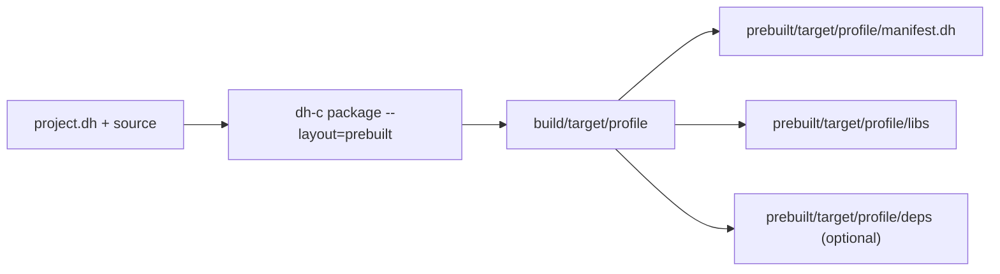

# dh-c Prebuilt Package Contract

## Purpose

Prebuilt packages are immutable SDK inputs. They are not ordinary `build/` cache entries. `dh-c` can use them for `dh` itself and for any dependency declared in `project.dh`.

## Layout

A platform-specific SDK or dependency package uses:

```txt
<project>/
  include/
  prebuilt/
    <normalized-target>/
      dev/
        manifest.dh
        libs/
        deps/
      fast/
        manifest.dh
        libs/
        deps/
      test/
        manifest.dh
        libs/
        deps/
      stable/
        manifest.dh
        libs/
        deps/
      release/
        manifest.dh
        libs/
        deps/
```

`libs/` contains the package's own artifacts. `deps/` is optional and contains transitive headers and link artifacts in the same relative layout that would otherwise be staged under `lib/deps/`.

Artifact names follow the normal library contract:

| Platform | Native static | LTO static | Shared | Import library |
| --- | --- | --- | --- | --- |
| Windows | `mylib.lib` | `mylib.lto.lib` | `mylib.dll` | `mylib.dll.lib` |
| Linux | `libmylib.a` | `libmylib.lto.a` | `libmylib.so` | — |

Every `kind=lib` profile contains the native static archive and shared artifact; Windows additionally contains the import library. Profiles with effective LTO also contain the `.lto` static archive so native and LTO consumers can select independently.

## Selection Modes

```txt
prebuilt=auto
prebuilt=off
prebuilt=required
```

- `auto` is the default. It uses a complete package when available and otherwise builds source.
- `off` always traverses and builds source.
- `required` rejects a missing package instead of silently building source.

The same values are accepted through `--prebuilt=<mode>`. A bare `--prebuilt` means `required`.

## Per-Dependency Selection

```txt
prebuilt=off

[fmt]
path=../fmt
linking=static
prebuilt=auto

[crypto]
path=../crypto
linking=shared
prebuilt=required
```

Here the project normally source-builds dependencies, `fmt` optionally consumes its package, and `crypto` must consume its shared package. Dependency-local policy is intentionally selectable independently from the project default.

## Tests And CI

A normal `dh-c test` may consume prebuilt dependencies. This lets CI rebuild only the current project and its test runner.

When dependency tests are explicitly requested with recursive testing or `test=true`, `dh-c` requires source for that dependency. A prebuilt library alone cannot represent or execute the dependency project's own tests.

## Package Boundaries

The current lookup assumes a platform-specific SDK archive: Windows and Linux packages should be distributed separately. LTO archives remain tied to the compatible compiler/LTO toolchain used by that SDK. Native archives and DLL/SO outputs are the compatibility fallback.

## Recommended SDK Profile Set

The artifact family does not change by profile:

- native static archive: every profile
- shared library: every profile
- Windows import library: every profile
- LTO static archive: profiles whose effective LTO mode is enabled

Profiles still select optimization, diagnostics, assertions, unwind, and LTO
policy. They do not silently redefine `kind=lib` into static-only output.
A producer may choose which profile directories to distribute, but any shipped
`kind=lib` profile follows the same artifact-family contract.

Header-only projects use `kind=lib` with an `include/` tree and no C sources.
They can be built and staged with the normal install package layout for every
profile, but they do not produce target-specific binary prebuilts or an empty
`manifest.dh`.

## Artifact manifest

Every target/profile directory must contain `manifest.dh`. dh-c rejects a missing,
malformed, unknown-key, or incompatible manifest before using the packaged artifact.
There is no legacy package fallback and no manifest format/version selector.

## Producer command

Run the package command once for each distributable profile:

```sh
dh-c package dev --layout=prebuilt
dh-c package fast --layout=prebuilt
dh-c package test --layout=prebuilt
dh-c package stable --layout=prebuilt
dh-c package release --layout=prebuilt
```

Each command builds the selected profile and replaces only its
`prebuilt/<normalized-target>/<profile>/` package. Producer object files, plans,
and other mutable build state remain under `build/` and are not distributed.


See [artifact-manifest.md](artifact-manifest.md).
