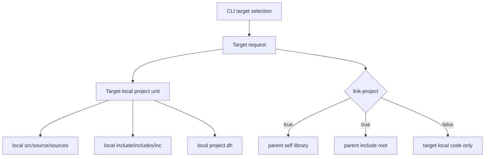
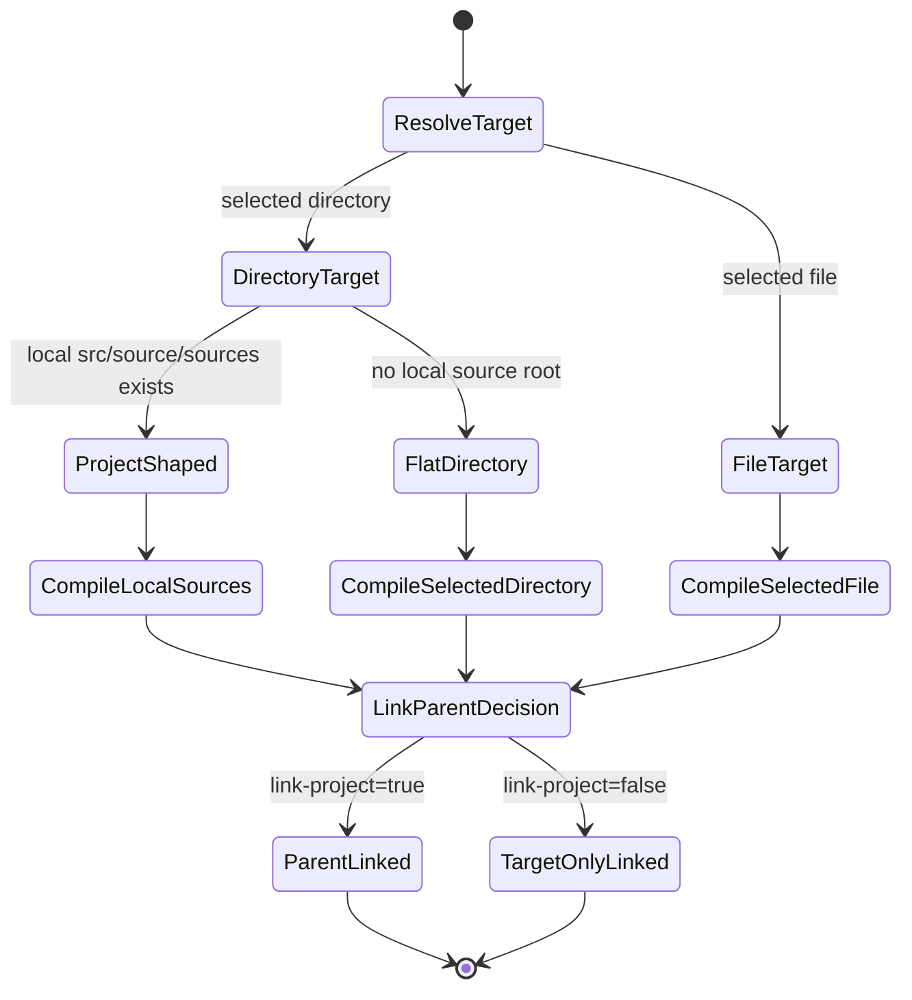
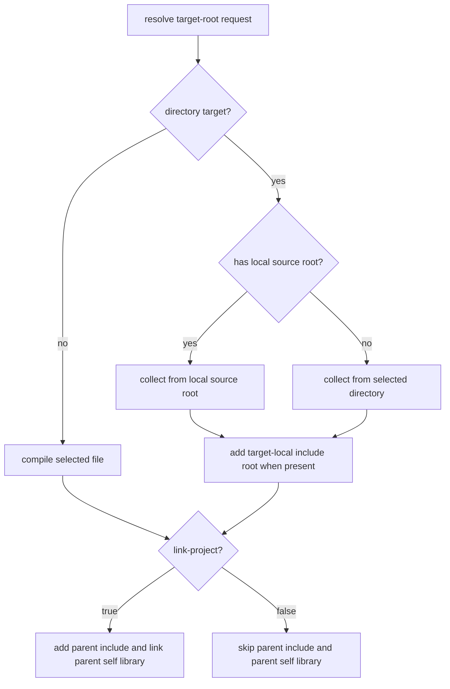

# `project.dh` Contract

## Goal
`project.dh` declares two different things:

- project-wide build defaults and reusable self code
- named target roots that describe where buildable targets live

The important distinction is:

- self roots describe code that belongs to the project itself and is reused internally
- target roots describe entry targets or artifact-producing targets such as `cmd`, `examples`, or `plugins`

## Explicit Rules

### Project-wide keys

Supported project-level keys:

```txt
output=<name>
build-runs-tests=<true|false>
no-dsl=<true|false>
pch=<auto|off|path>
pch-exclude=<header>
self-root=<path>
link-dir=<path>
prebuilt=<auto|off|required>
```

Meaning:

- `output=` sets the default output name when the CLI does not provide one
- `build-runs-tests=` makes plain `dh-c build` run tests afterward
- `no-dsl=` disables automatic `dh` linking for that project or target
- `pch=` and `pch-exclude=` control the PCH contract
- repeated `self-root=` entries declare reusable self-project source roots
- repeated `link-dir=` entries add library search directories for linked outputs
- `prebuilt=` selects whether packaged `prebuilt/<profile>` artifacts are preferred, ignored, or required

### Target-root blocks

Target roots are declared with:

```txt
[target-root <name>]
path=<path>
kind=<executable|static-lib|shared-lib>
selection=<path|file|dir>
link-project=<true|false>
```

Meaning:

- `<name>` is a semantic label, not an artifact kind
- `path=` is the root directory for that target family
- `kind=` chooses the produced artifact type
- `selection=` controls whether the CLI target under that root may be a file, a directory, or either
- `link-project=` controls whether the target links the parent project's cached reusable unit and includes the parent project headers

## Implicit Rules

These defaults currently apply when the contract does not say otherwise.

### Automatic source collection filters

When `dh-c` collects sources automatically from project roots or built-in target
families, it skips path segments that start with `.`.

That means hidden directories or files such as `.git`, `.cache`, `.archive`,
or `.local.c` are ignored during automatic recursive collection.

This automatic filter does not override explicit CLI intent:

- explicit file inputs are still accepted
- explicit directory inputs are still traversed as requested
- explicit target-root paths are still traversed as requested

### Self roots

If no `self-root=` is declared, `dh-c` uses the resolved project `src` root as the only self root.

That means this:

```txt
# no self-root entries
```

is treated like:

```txt
self-root=src
```

after directory-alias resolution.

### Built-in target roots

If you do not declare target roots for `samples`, `examples`, or `tests`, `dh-c` still creates built-in roots for those categories so these compatibility shorthands keep working:

- `--sample`
- `--example`
- `--test`

Those built-in roots inherit the resolved project category directory names, including supported aliases such as `example/` and `sample/`.

### Target-root block defaults

Inside a `[target-root ...]` block:

- `kind=` defaults to `executable`
- `selection=` defaults to `path`
- `link-project=` defaults to `true`

Only `path=` is effectively mandatory for a meaningful target root.

### Directory target local layout

When a target-root selection resolves to a directory, `dh-c` treats that
directory as a target-local project unit if it has project-shaped category
roots:

- `src/`, `source/`, or `sources/` becomes the target-local source root
- `include/`, `includes/`, or `inc/` becomes the target-local include root
- `project.dh` provides target-local build defaults and compiler options

If no target-local source root exists, source collection falls back to the
selected directory itself for compatibility with flat target directories.

Target-local `project.dh` is applied after the parent project's defaults and
before source companion `.dh` files, explicit `.dh` files, and CLI options. That
means a directory target can set its own `output=`, `kind=`, `link-dsl=`, or
similar defaults while command-line options still have final priority.

`link-project=` controls whether the parent project participates:

- `link-project=true` links the parent project's reusable self library and adds
  the parent project include root
- `link-project=false` builds only the target-local code plus explicit
  dependency and CLI include inputs

Built-in `samples`, `examples`, and `tests` roots use the same directory target
rules as explicit target roots.

Architecture view:



State view:



Flow view:



### Output naming defaults

When the CLI does not provide `--output` and no companion `.dh` overrides it:

- plain project build defaults to project name
- file target defaults to file basename without extension
- directory target defaults to directory basename

Examples:

- `build cmd/runner1` -> output name `runner1`
- `build plugins/render` with `kind=shared-lib` -> output name `render`
- `build src/main.c` -> output name `main`

`output=` in `.dh` is an output name, not a filename with a required extension.
The selected target kind generates its own platform extension:

- executable: `.exe` on Windows, no extra suffix on POSIX
- static library: `.lib` on Windows, `lib*.a` on POSIX
- shared library: `.dll` on Windows, `lib*.so` on POSIX
- image, preprocessed, and assembly outputs: `.bin`, `.i`, and `.s`

CLI `--output` accepts either an output stem or an output directory. A path that
ends with a separator or names an existing directory is treated as a directory;
the resolved output name is placed inside it. Other path-like values are treated
as stems and receive the target extension. For `kind=lib`, one stem produces both
the static and shared library outputs. Values that already name a single library
artifact such as `.lib`, `.dll`, `.a`, or `.so` are rejected for `kind=lib`.
Use `--output-ext=<.ext>` with a single artifact target such as `--shared` when
the default generated extension is not the desired loadable module suffix.
Use `--link-dir <path>` or `-L<path>` with `--link <name>`/`-l<name>` for
structured library search paths instead of raw `--link-args="-L... -l..."`.

## Resolution Rules

### Plain build without target root

These keep their direct meaning:

- `dh-c build`
- `dh-c build foo.c`
- `dh-c run foo.c`
- `dh-c test`

They operate on plain project sources or explicit source files, not on declared target-root contracts.

### Build through target roots

When the given path falls under a declared target root, the target-root contract applies.

Example:

```txt
self-root=src
self-root=pkg

[target-root cmd]
path=cmd
kind=executable
selection=dir
link-project=true
```

Then:

```sh
dh-c build cmd/runner1
dh-c run cmd/runner1
```

means:

- compile only sources under `cmd/runner1`
- reuse cached self sources from `src` and `pkg`
- link the self unit because `link-project=true`

### Compatibility shorthands

These are still accepted:

```sh
dh-c build --example example-color.c
dh-c run --sample sample-basic.c
dh-c build --test test-parser.c
```

They are compatibility shorthands for the built-in `examples`, `samples`, and `tests` target roots.

For new project-local architecture, prefer explicit `[target-root ...]` blocks over relying on those flags alone.

## Conflict Rules

`dh-c` rejects these early:

- duplicate target-root names
- duplicate target-root paths
- invalid `kind=`
- invalid `selection=`
- multiple alias directories for the same built-in category at the same project level

## Examples

### Folder-based executable targets

```txt
self-root=src
self-root=internal

[target-root cmd]
path=cmd
kind=executable
selection=dir
link-project=true
```

### Shared-library plugin targets

```txt
self-root=src

[target-root plugins]
path=plugins
kind=shared-lib
selection=dir
link-project=true
```

### Minimal project using only implicit defaults

```txt
output=my-project
```

This still implies:

- self root: resolved `src`
- built-in compatibility roots: resolved `samples`, `examples`, `tests`

## Companion `.dh` Files

Companion `.dh` files still apply to the owning build target and can override:

- `output=`
- `build-runs-tests=`
- `no-dsl=`

Dependency blocks in `project.dh` may additionally set:

```txt
test=true
prebuilt=auto
```

- `test=true` runs that dependency's tests during dependency traversal.
- `prebuilt=auto|off|required` selects the packaged-artifact policy for that specific dependency. An explicitly written `auto` remains distinct from an inherited value, so a dependency can opt back into optional prebuilt use even when the consumer project defaults to `prebuilt=off`.

Packaged artifacts live outside the mutable build cache:

```txt
<dependency>/
  prebuilt/
    <profile>/
      libs/
        libfoo.a
        libfoo.lto.a
      deps/
```

On Windows the corresponding names are `foo.lib`, `foo.lto.lib`, `foo.dll`, and `foo.dll.lib`. The optional `deps/` directory carries transitive staged headers and libraries.

## Project-local version namespace

A project that declares version fields may also declare an explicit C identifier namespace:

```ini
version-namespace=dacolor
version-core=1.4.2
version-prefix=rc
version-suffix=2
version-build=git.a31f9d2
```

`dh-c` exports only raw constants under that namespace:

```c
dacolor__NUM__VER_CORE_MAJOR
dacolor__NUM__VER_CORE_MINOR
dacolor__NUM__VER_CORE_PATCH
dacolor__NUM__VER_LABEL_PREFIX
dacolor__STR__VER_LABEL_PREFIX
dacolor__NUM__VER_LABEL_SUFFIX
dacolor__STR__VER_LABEL_SUFFIX
dacolor__STR__VER_BUILD
```

The consuming header owns all packing, formatting, and version semantics. `dh-c` does not generate headers or interpret the resulting version. When `version-namespace` is omitted, the detected project directory name is converted to a C identifier by replacing non-identifier characters with `_`.
