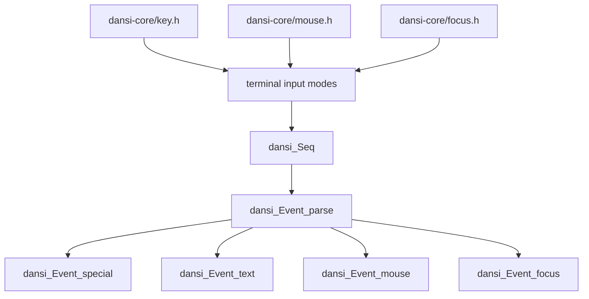
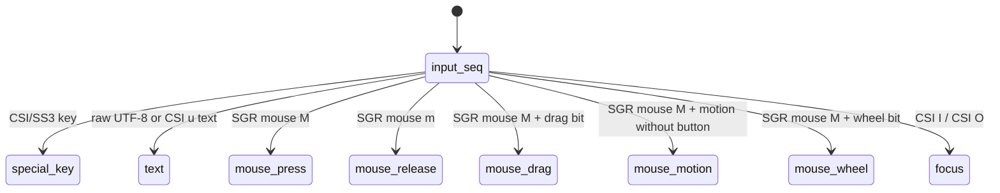
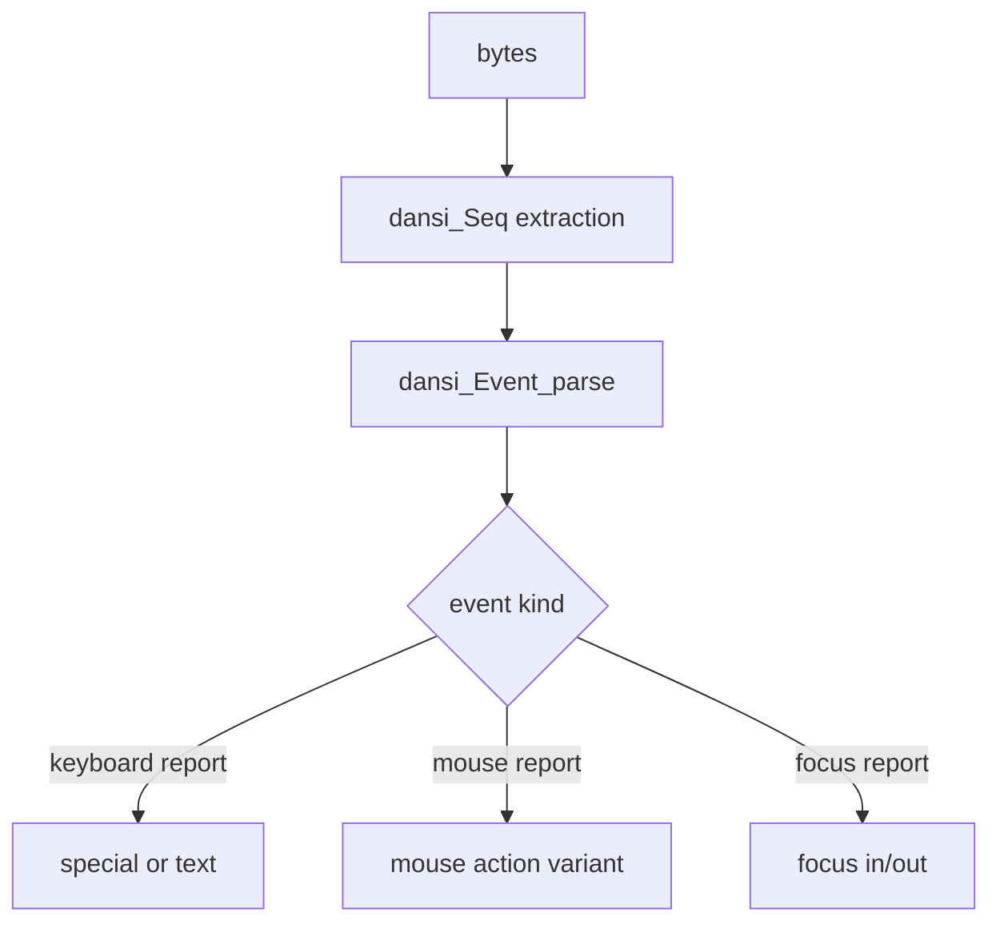

# dansi

`dansi` is a pure ANSI-family terminal protocol library for DH-C.

It does not own a terminal, switch raw mode, track lifecycle state, flush output,
or call OS terminal APIs. It only builds byte sequences, writes them through
`io_Writer`, receives response bytes through `io_Reader`, and parses protocol
reports into typed values.

That boundary is deliberate: `dansi` is the protocol layer between a terminal
implementation and application code. Higher layers can expose an
`io_Writer`/`io_Reader` pair, and users can call `dansi` through that contract.
Backends may pass bytes through to an OS terminal, or parse/intercept them for a
virtual terminal or native fast path.

## Package Shape

```txt
include/
  dansi.h           package umbrella
  dansi-core.h      ANSI and xterm protocol umbrella
  dansi-kitty.h     kitty extension boundary
  dansi-sixel.h     sixel extension boundary

include/dansi-core/
  utils.h           CSI/OSC/DCS/raw protocol constants and format helpers
  Seq.h             ANSI-family byte sequence extraction
  Event.h           input report parsing (keys, mouse, focus)
  attr.h            selective SGR resets
  style.h           boolean SGR style toggles
  color.h           4-bit, 8-bit, and RGB color SGR
  Palette4bit.h     4-bit color enum
  Palette8bit.h     8-bit color enum
  cursor.h          cursor movement, style, reports
  line.h            line clearing
  screen.h          screen clearing, alternate buffer, size reports
  scroll.h          scroll region control
  mode.h            ANSI/private mode control
  key.h             xterm key modifier/format options (XTMODKEYS / XTFMTKEYS)
  focus.h           focus tracking mode controls (mode 1004)
  mouse.h           mouse tracking mode controls
  window.h          xterm window manipulation controls (XTWINOPS)
  resource.h        xterm resource and termcap/terminfo DCS controls
  graphics.h        xterm graphics attribute controls
  title.h           OSC title operations
  device.h          device status and attribute reports
  palette.h         xterm palette stack controls
```

## API Families

Most command modules expose three forms.

### Compile-time static form

`*_static(...)` macros build string literals from token arguments when the value
is known at compile time.

```c
let bytes = u8_l(dansi_cursor_moveTo_static("12", "3"));
```

Enum-like APIs also provide `*_staticParse(...)` so symbolic values can be used
without runtime formatting.

```c
let seq = u8_l(dansi_cursor_setStyle_static(
    dansi_cursor_Style_staticParse(dansi_cursor_Style_bar)
));
```

### Runtime buffer form

Runtime formatters write into caller-owned fixed buffers and return the written
slice. The required buffer type is part of the API.

```c
var_(buf, dansi_cursor_MovePosBuf) $undefined;
let bytes = dansi_cursor_moveTo(12, 3, &buf);
try_(io_Writer_writeBytes(out, bytes.as_const));
```

### Writer form

`*Write(...)` writes the sequence to an `io_Writer` and returns `E$void`.

```c
try_(dansi_cursor_moveToWrite(12, 3, out));
try_(dansi_style_boldWrite(true, out));
try_(io_Writer_writeBytes(out, u8_l("ready")));
try_(dansi_attr_resetWrite(out));
```

Writer functions do not flush. Flushing, buffering, OS handles, and terminal
lifetime belong to the caller or a higher layer.

## Requests And Reports

Terminal queries are modeled as protocol operations, not hidden terminal state.
The naming convention is:

- `request*` creates or writes request bytes.
- `receive*Report` reads one complete report byte sequence.
- `parse*Report` parses already-read report bytes.
- `fetch*` performs request, receive, and parse in one convenience call.

For example, cursor position can be used as separate stages:

```c
var_(buf, dansi_cursor_PosReportBuf) $undefined;

try_(dansi_cursor_requestPosWrite(out));
let report = try_(dansi_cursor_receivePosReport(in, A_ref$((S$u8)(buf))));
let pos = try_(dansi_cursor_parsePosReport(report.as_const));
```

Or as one convenience operation:

```c
var_(buf, dansi_cursor_PosReportBuf) $undefined;
let pos = try_(dansi_cursor_fetchPos(out, in, A_ref$((S$u8)(buf))));
```

The same pattern is used for device reports and screen size reports:

```c
var_(buf, dansi_screen_SizeReportBuf) $undefined;
let size = try_(dansi_screen_fetchTextAreaSizeChars(out, in, A_ref$((S$u8)(buf))));
```

Because these APIs only use `io_Writer` and `io_Reader`, a backend can intercept
the request bytes and provide a native or virtual response while the caller still
uses the same `dansi` protocol function.

## Sequence Extraction

`dansi_Seq` is the normalized boundary for parsing terminal input. It classifies
borrowed bytes as raw, ESC, CSI, SS3, OSC, or DCS.

```c
var reader = io_Buf_Reader_init(input, A_ref$((S$u8)(buf)));
let seq = try_(dansi_Seq_extract(&reader));
```

`dansi_Seq_extract` requires an `io_Buf_Reader` because terminal input can arrive
in fragments. The returned slice is borrowed from the buffered reader and remains
valid only until that buffer is mutated again.

Report helpers that only need a complete CSI response use `dansi_Seq_receiveCSI`
internally so split reports are handled without assuming a single read contains
the whole response.

## Events

`dansi-core/Event.h` parses terminal input reports from ANSI/xterm byte
streams: special keys (legacy CSI, SS3, modified CSI, tilde CSI), text input
(including CSI `u`), SGR mouse reports, and focus-in/out (mode 1004).
Mouse reports are represented as nested action variants (`press`, `release`,
`drag`, `motion`, `wheel`) so wheel, motion, and button states cannot be mixed
as unrelated flags.

`dansi-core/focus.h` and `dansi-core/mouse.h` write the private-mode sequences
that enable those reports. `dansi-core/key.h` writes xterm key modifier/format
option sequences.

Core input domain atoms live outside the parsed event layer:

- `dansi-core/key.h`: key codes and modifier bits
- `dansi-core/mouse.h`: `dansi_mouse_Btn` including backward/forward/auxiliary
  buttons, `dansi_mouse_Btns`, four-direction wheel values, and tracking modes
- `dansi-core/Event.h`: parsed input report variants that combine those atoms

`dansi_Event_MouseBtnReport.btn` is always a concrete `dansi_mouse_Btn`.
Reports without a concrete button are represented by non-button variants such as
`motion`. Multiple button state belongs to `dansi_mouse_Btns`; SGR reports still
expose the single button identity that the protocol encodes.

```c
try_(dansi_mouse_enableAnyWrite(out));
try_(dansi_mouse_enableSGRWrite(out));
try_(dansi_focus_enableTrackingWrite(out));
try_(dansi_key_enableEnhancedWrite(out));

let event = try_(dansi_Event_parse(seq));
```







Broader keyboard protocols, such as kitty keyboard extensions, belong in the
`dansi-kitty` extension instead of being folded into core events.

## Xterm Scope

`dansi-core` owns xterm protocol surfaces that are already treated as part of
the common terminal contract by the rest of the package. Separate named
extension umbrellas remain for protocols with their own negotiation and payload
models, such as kitty and sixel.

| xterm surface | core boundary |
| --- | --- |
| keyboard modifier and format controls | `dansi-core/key.h` |
| legacy, modified, tilde, and CSI `u` key reports | `dansi-core/Event.h` |
| focus tracking controls and reports | `dansi-core/focus.h`, `dansi-core/Event.h` |
| mouse tracking controls and SGR reports | `dansi-core/mouse.h`, `dansi-core/Event.h` |
| private modes shared by ANSI/xterm-compatible terminals | `dansi-core/mode.h` |
| xterm window controls (XTWINOPS) | `dansi-core/window.h` |
| title operations and title stack | `dansi-core/title.h` |
| palette stack controls | `dansi-core/palette.h` |
| SGR/video-attribute stack controls and rectangular SGR reports | `dansi-core/attr.h` |
| graphics attribute controls (XTSMGRAPHICS) | `dansi-core/graphics.h` |
| resource and termcap/terminfo DCS controls | `dansi-core/resource.h` |

## Control Examples

### Alternate screen

```c
try_(dansi_screen_enterAlternateWrite(out));
defer_(catch_((dansi_screen_exitAlternateWrite(out))($ignore, $do_nothing)));
```

`dansi` only writes the bytes. Whether this should be part of a terminal
lifecycle is a higher-layer policy decision.

### Clearing a message line without logical newlines

```c
try_(dansi_cursor_storePosWrite(out));
try_(dansi_cursor_moveNextLineWrite(1, out));
try_(dansi_line_clearWrite(out));
try_(io_Writer_writeBytes(out, u8_l("Only ASCII characters are allowed.")));
try_(dansi_cursor_restorePosWrite(out));
```

Use cursor movement for terminal layout. `io_Writer_nl` is a logical text LF,
not a terminal "next line" control.

### Static mode selection

```c
let bytes = u8_l(dansi_mode_enablePrivate_static(
    dansi_mode_Private_staticParse(dansi_mode_Private_bracketed_paste)
));
```

Runtime and writer forms are also available when the value is not compile-time
known.

## Verification

Tests live under `tests/test-*.c`.

```sh
dh-c test
```

When running from a dependent package and including recursive package tests:

```sh
dh-c test --recur
```

The current tests cover static sequence generation, writer output, split report
receiving, report parsing, and core input event parsing (keys, mouse, focus).
