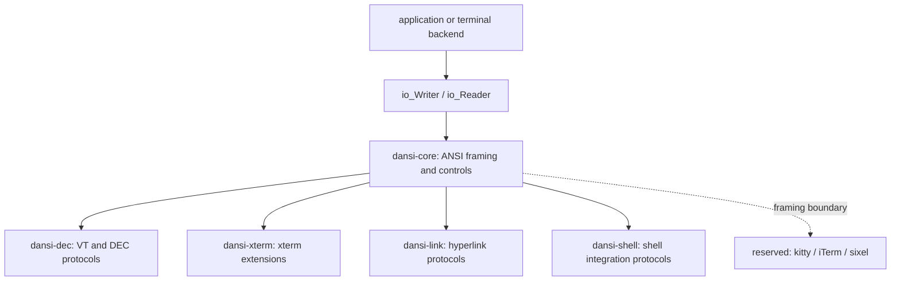
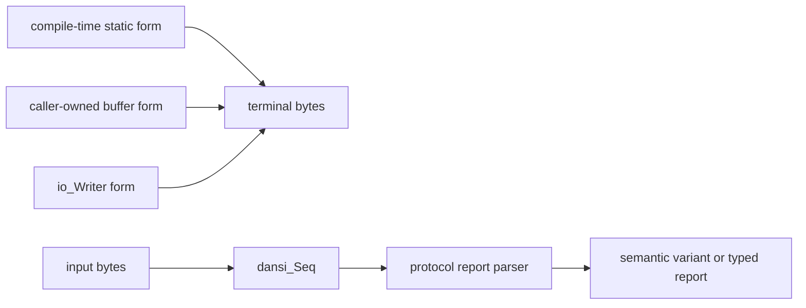

# dansi

`dansi` is a terminal protocol library for DH-C. It builds, writes, receives,
and parses ANSI-family terminal byte sequences without owning terminal state or
performing OS terminal setup.

The library does not switch raw mode, flush output, manage terminal lifetime,
or call platform terminal APIs. Those responsibilities belong to a terminal
backend or application layer that supplies `io_Writer` and `io_Reader` values.

## Architecture

Protocol ownership is explicit. ECMA-48 framing and standard controls live in
core; DEC, xterm, hyperlink, and shell-integration protocols are separate
modules layered on that base.





## Umbrellas

| Header          | Ownership                                                                                                                    |
| --------------- | ---------------------------------------------------------------------------------------------------------------------------- |
| `dansi-core.h`  | C0/C1 catalogs, ESC/CSI/control-string framing, standard cursor, erase, scroll, mode, SGR, style, color, and device reports  |
| `dansi-dec.h`   | DEC terminal models, charset designation, DECCKM/DEC modes, VT keys and keypad, DECSTBM, device attributes, and DEC reports  |
| `dansi-link.h`  | OSC 8 hyperlinks                                                                                                             |
| `dansi-shell.h` | OSC 7 current directory, OSC 133 FinalTerm marks, and OSC 633 VS Code shell integration                                      |
| `dansi-xterm.h` | xterm modes, input extensions, screen/window/title operations, selections, resources, extended color, and palette operations |
| `dansi.h`       | Package umbrella in dependency order                                                                                         |

`dansi-kitty.h`, `dansi-iterm.h`, and `dansi-sixel.h` reserve independent
extension boundaries. They are not folded into core or xterm.

## Module Shape

### Core

- `c0.h`, `c1.h`, `ctrl.h`: control catalogs and classification.
- `Seq.h`: sequence classification and buffered receive helpers.
- `esc.h`, `csi.h`: raw framing, parsing, and CSI parameter/subparameter
  iteration.
- `osc.h`, `dcs.h`, `pm.h`, `apc.h`, `sos.h`: raw control-string framing,
  terminator selection, and parsing.
- `cursor.h`, `erase.h`, `scroll.h`, `mode.h`: standard terminal controls.
- `sgr.h`, `style.h`, `color.h`: raw SGR, style conveniences, and standard
  8-color foreground/background operations.
- `device.h`: standard device status and attributes requests and reports.

### DEC

- `model.h`: DEC terminal model feature catalog.
- `charset.h`: G0-G3 designation and shift controls.
- `cursor.h`, `mode.h`, `scroll.h`: DEC save/restore cursor, private modes,
  cursor style, and top/bottom margins.
- `key.h`: VT cursor, PF, editing, function, and application-keypad reports.
- `device.h`, `report.h`: DEC device attributes and printer/keyboard status
  reports.

### Xterm

- `mode.h`: raw and typed xterm private-mode controls.
- `mouse.h`: separate report-mode and encoding-mode controls, raw SGR packets,
  and semantic mouse-event variants.
- `key.h`: xterm modifier resources, `modifyOtherKeys`, CSI-u formatting, raw
  key reports, and semantic key-event variants.
- `focus.h`, `paste.h`: focus and bracketed-paste controls and reports.
- `screen.h`, `window.h`, `title.h`: alternate screen, XTWINOPS, screen size,
  window state/position, title stack, and title reports.
- `selection.h`, `resrc.h`: OSC 52 selections and xterm resource/termcap DCS
  operations.
- `sgr.h`, `color.h`, `Palette4bit.h`, `Palette8bit.h`, `palette.h`: xterm SGR
  stack, bright/indexed/RGB color, palette catalogs, palette stack, and palette
  query reports.

## API Forms

An operation is grouped by name and normally exposes these forms:

```c
// Compile-time string composition.
let static_bytes = u8_l(dansi_cursor_moveTo_static("12", "34"));

// Runtime formatting into a caller-owned, operation-sized buffer.
var_(buf, dansi_cursor_MoveToBuf) $undefined;
let bytes = dansi_cursor_moveTo(12, 34, &buf);

// Direct output without an intermediate caller buffer.
try_(dansi_cursor_moveToWrite(12, 34, out));
```

The naming order is always `someOp_static`, `someOp`, `someOpWrite`. Static
parsers such as `dansi_sgr_Code_staticParse(...)` convert symbolic catalog
values into compile-time string fragments.

Writer functions do not flush.

## Protocol Constants

Public wire constants are available in the representation needed by both
compile-time composition and runtime parsing:

- `name`: string fragment, backed by `__str__name`.
- `name_byte`: one wire byte, backed by `__uint__name_byte`.
- `name_u16`: numeric protocol parameter or command, backed by
  `__uint__name_u16`.

Derived static sequences are assembled from these constants instead of
repeating protocol literals. Parser indexes, bit masks, bounds, and radices are
named numeric constants but are not represented as wire strings.

## Framing And Parsing

Core framing preserves raw protocol fields. OSC parsing, for example, does not
require every payload to be a numeric-command form:

```c
let frame = try_(dansi_osc_parse(bytes));

if_some((dansi_osc_Frame_splitCmd(frame))(split)) {
    if_some((dansi_osc_CmdSplit_cmdAsU16(split))(cmd)) {
        // Dispatch the numeric OSC command while retaining split.payload.
    }
}
```

CSI frames preserve raw parameters and intermediates. Iterators distinguish
semicolon parameters, empty/defaulted parameters, and colon subparameters:

```c
let frame = try_(dansi_csi_parse(bytes));
var params = dansi_csi_Frame_paramIter(frame);

while_some((dansi_csi_ParamIter_next(&params)), param) {
    var subparams = dansi_csi_Param_subparamIter(param);
    while_some((dansi_csi_SubparamIter_next(&subparams)), subparam) {
        // subparam is the borrowed raw field, including an empty field.
    }
}
```

Control-string builders default to 7-bit ST. `makeWithEOS` and `writeWithEOS`
variants select BEL, 7-bit ST, or 8-bit ST where the protocol permits it.

## Sequence Input

`dansi_Seq` classifies text, C0, generic C1, ESC, CSI, SS2, SS3, OSC, DCS, PM,
APC, and SOS input. `dansi_Seq_extract` operates on `io_Buf_Reader`; the typed
`dansi_Seq_receive*` helpers receive one complete sequence from `io_Reader`.

Protocol modules then interpret only the reports they own:

```txt
dansi_Seq
  -> dansi_dec_key_parseReport / interpretReport
  -> dansi_xterm_key_parseReport / interpretReport
  -> dansi_xterm_mouse_parseSGRReport / interpretSGR
  -> plain text or another extension parser
```

Raw packets and semantic events are separate. For example,
`dansi_xterm_mouse_SGRReport` preserves `cb`, coordinates, and final byte, while
`dansi_xterm_mouse_Event` is a variant of press, release, motion, and wheel
events. Key reports use the same report-then-interpret model.

## Mouse Configuration

Mouse reporting policy and report encoding are independent:

```c
try_(dansi_xterm_mouse_enableReportModeWrite(
    dansi_xterm_mouse_ReportMode_any_event, out
));
try_(dansi_xterm_mouse_enableEncodingWrite(
    dansi_xterm_mouse_Encoding_sgr, out
));
```

The convenience operation configures both sides for SGR reporting:

```c
try_(dansi_xterm_mouse_enableSGRWrite(
    dansi_xterm_mouse_ReportMode_any_event, out
));
```

## Requests And Reports

Query APIs expose each protocol stage instead of hiding IO:

- `request*`: build or write request bytes.
- `receive*Report`: receive one complete protocol report.
- `parse*Report`: parse bytes already owned by the caller.
- `fetch*`: request, receive, and parse in one convenience operation.

```c
var_(report_buf, dansi_cursor_PosReportBuf) $undefined;

try_(dansi_cursor_requestPosWrite(out));
let report = try_(dansi_cursor_receivePosReport(
    in, A_ref$((S$u8)(report_buf))
));
let pos = try_(dansi_cursor_parsePosReport(report.as_const));
```

The combined form is:

```c
let pos = try_(dansi_cursor_fetchPos(
    out, in, A_ref$((S$u8)(report_buf))
));
```

The same staged flow is used by DEC reports and xterm screen, window,
title, palette, and resource queries where the protocol provides a response.

## OSC Extension Examples

```c
try_(dansi_link_osc8_openWithIdWrite(
    u8_l("https://example.com"), u8_l("issue-42"), out
));
try_(io_Writer_writeBytes(out, u8_l("link text")));
try_(dansi_link_osc8_closeWrite(out));

try_(dansi_shell_osc7_setRawWrite(
    u8_l("file://host/workspace"), out
));
```

OSC 8 builders accept no parameters, an `id`, or raw parameter text. Parsed
OSC 8 parameters retain the raw field and expose `id` as optional convenience.
Shell string APIs distinguish encoded operations from `Raw` operations when
the protocol requires escaping.

## Build And Verification

Build the library from `dh-examples/dansi`:

```bash
dh-c build
```

Build an individual test by passing its file name after `--test`:

```bash
dh-c build --test test-core_framing.c
dh-c build --test test-core_ops.c
dh-c build --test test-core_reports.c
dh-c build --test test-core_seq.c
dh-c build --test test-dec_ops.c
dh-c build --test test-link_shell.c
dh-c build --test test-xterm_ops.c
```

Built test executables are written under `build/dev/tests/`. The current suite
covers framing, static/runtime/writer equivalence, split report receiving,
standard and DEC reports, VT/xterm key interpretation, SGR mouse events, OSC
link/shell protocols, and xterm screen/window/title/color/palette operations.
