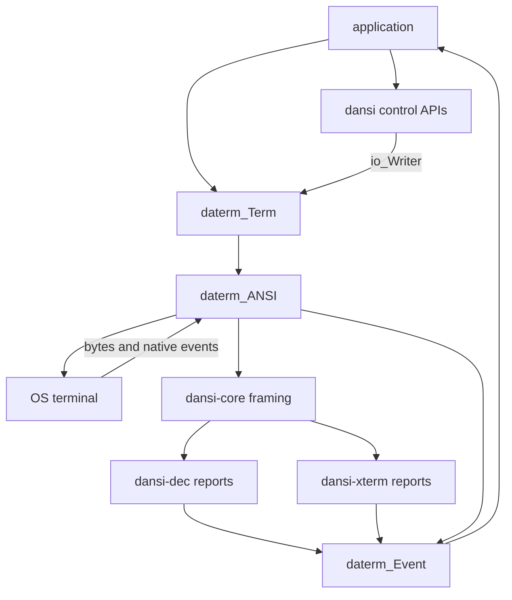
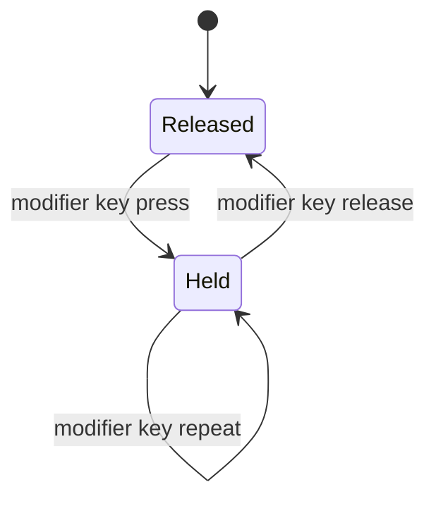
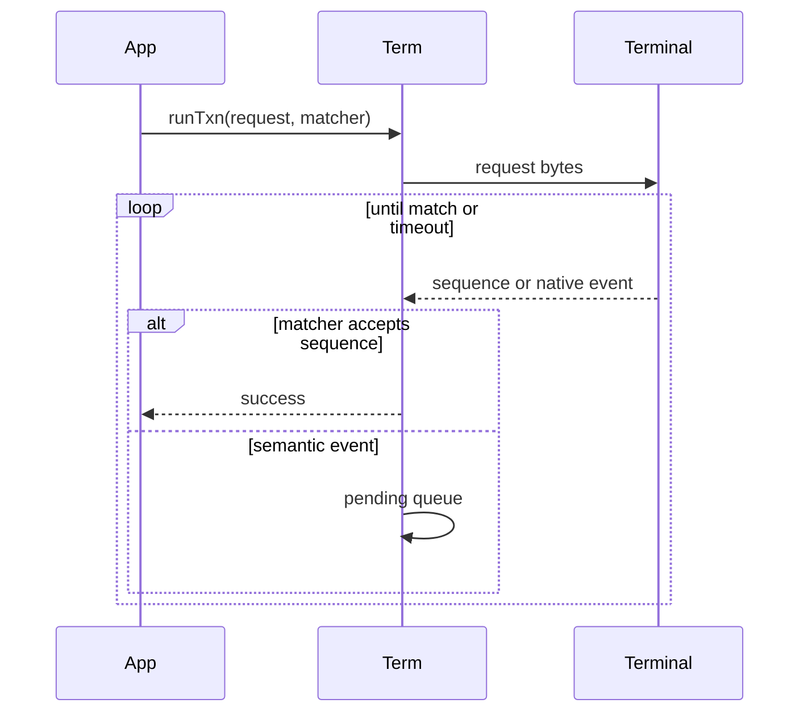
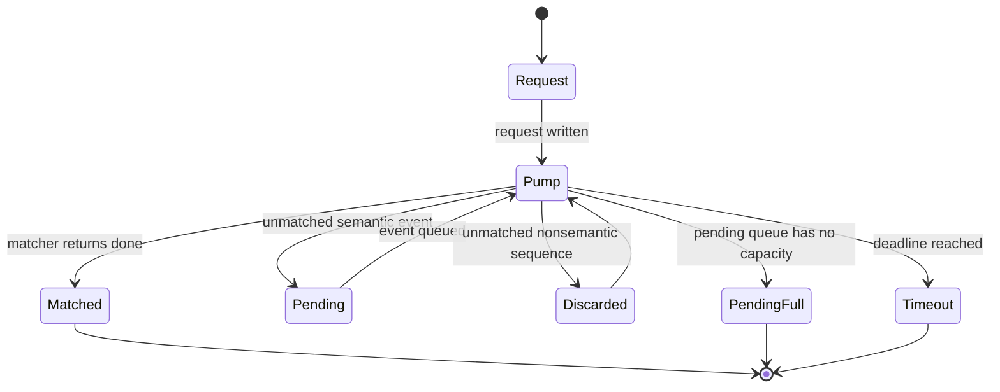

# daterm

`daterm` is the terminal runtime layer for DH-C. It owns OS terminal lifecycle,
nonblocking input, backend dispatch, and protocol-neutral runtime events.
`dansi` owns terminal control construction, sequence framing, and protocol
report parsing.



## Boundary

Applications compose output with the module that owns each protocol operation
and write through `daterm_Term_writer`:

```c
#include <dansi-core.h>
#include <dansi-xterm.h>
#include "daterm.h"

let out = daterm_Term_writer(term);
try_(dansi_erase_inDisplayWrite(dansi_erase_Area_all, out));
try_(dansi_cursor_moveToWrite(1, 1, out));
try_(dansi_xterm_color_fg24bitWrite((dansi_xterm_color_RGB8){
    .r = 255, .g = 220, .b = 80,
}, out));
try_(io_Writer_writeBytes(out, u8_l("ready")));
try_(dansi_sgr_resetWrite(out));
```

`daterm` does not duplicate those operations as drawing methods. The runtime
provides the reader/writer and handles terminal state that requires an OS
backend.

## Package Shape

```txt
include/
  daterm.h
  daterm-runtime.h
  daterm-context.h
  daterm-bridge.h

include/daterm-runtime/
  base.h
  input.h
  key.h
  mouse.h
  focus.h
  Event.h
  Caps.h
  Query.h
  Txn.h
  Term.h

include/daterm-context/
  ANSI.h
  ANSI/private.h

include/daterm-bridge/
  xterm.h
```

`daterm_Term` exposes polling, waiting, reader/writer access, and native screen
or cursor queries. `daterm_ANSI` is the concrete current-terminal context for
Windows and POSIX.

## Lifecycle

```c
var heap = heap_Sys_init();
defer_(heap_Sys_fini(&heap));

var cfg = daterm_ANSI_Cfg_default(heap_Sys_alctr(&heap));
cfg.input_mode = daterm_ANSI_InputMode_vt;
var ansi = try_(daterm_ANSI_init(cfg));
defer_(daterm_ANSI_fini(&ansi));

try_(daterm_ANSI_enableRawMode(&ansi));
defer_(daterm_ANSI_disableRawMode(&ansi));

try_(daterm_xterm_enableMouse(&ansi, (daterm_xterm_MouseCfg){
    .report_mode = dansi_xterm_mouse_ReportMode_button_event,
    .encoding = dansi_xterm_mouse_Encoding_sgr,
}));
defer_(daterm_xterm_disableMouse(&ansi));

let term = daterm_ANSI_term(&ansi);
```

Raw mode is a backend primitive. Mouse, focus, and enhanced keyboard settings
are xterm bridge operations and are configured independently.

On Windows, `daterm_ANSI_InputMode_native` consumes `KEY_EVENT` records and
provides press/repeat/release actions. `daterm_ANSI_InputMode_vt` provides the
VT byte stream needed by protocol transactions. `daterm_Term_caps` reports the
selected guarantee; the two input ownership models are not mixed implicitly.

## Input Model

`daterm_ANSI` frames input without blocking a render loop. Partial CSI and
control strings remain buffered, while a standalone ESC is emitted after the
configured timeout.

Protocol dispatch is ordered by ownership and information content:

1. xterm focus and SGR mouse reports
2. xterm enhanced key reports with modifiers or CSI-u payloads
3. DEC/VT baseline key and keypad reports
4. xterm legacy fallback reports
5. UTF-8 text and C0 key interpretation

The result is a `daterm_Event` variant:

- `daterm_Event_key`
- `daterm_Event_text`
- `daterm_Event_mouse`
- `daterm_Event_focus`
- `daterm_Event_resize`

Mouse input is itself a variant with `press`, `release`, `motion`, and `wheel`
payloads. Positions carry a cell/pixel kind. Key and text events carry an
optional action, because legacy VT input cannot report releases while native
backends can.

`daterm_input_Mods` is the modifier snapshot attached to a key, text, or mouse
event. Applications use it to dispatch chords such as Ctrl+C, Shift+Space, or
Alt+Enter. It is not a held-state store.

Modifier keys are also represented by `daterm_key_Code_left_shift` through
`daterm_key_Code_right_meta`. When `daterm_TermCaps.modifier_key_event` is true,
their key events and actions can drive an application-owned held-state model.
`daterm_TermCaps.key_action` independently states whether key press, repeat,
and release actions are available.



Windows native input provides both capabilities and preserves modifier side.
VT input with xterm enhanced keys provides modifier snapshots on reported
chords but does not provide standalone modifier events or release actions.
Applications needing continuous input must use true key actions when available
and an explicit fallback policy otherwise.

## Runtime Queries And Transactions

`daterm_Term_queryLocal` handles only native or cached state. Protocol reports
use `daterm_Term_runTxn`, which writes a request, pumps complete sequences, and
queues unrelated semantic events for subsequent `poll` or `wait` calls.
Matchers receive the complete `dansi_Seq`, including its framing kind. An
unmatched sequence that has no semantic runtime-event interpretation is
currently discarded; preserving such reports requires an owned raw-sequence
queue because sequence bytes otherwise remain views into the input buffer.

Protocol-specific bridge helpers compose the corresponding dansi request and
parser with that broker:

```c
var_(cell_pixels, dansi_xterm_screen_PixelSize) $undefined;
try_(daterm_xterm_fetchCellPixels(
    term, time_Dur_fromMillis(20), &cell_pixels
));
```





## Verification

Build the library and each declared artifact explicitly:

```sh
dh-c build
dh-c build --test test-context_ANSI.c
dh-c build --example example-color.c
dh-c build --example example-event.c
dh-c build --example example-screen.c
dh-c build --example example-tetris.c
```

The ANSI test covers nonblocking text, C1 CSI and control-string framing, ESC
timeout behavior, DEC keys, xterm modified keys and CSI-u text, SGR mouse,
focus, Windows input-mode capabilities and native key actions, and
platform-gated raw output behavior.
