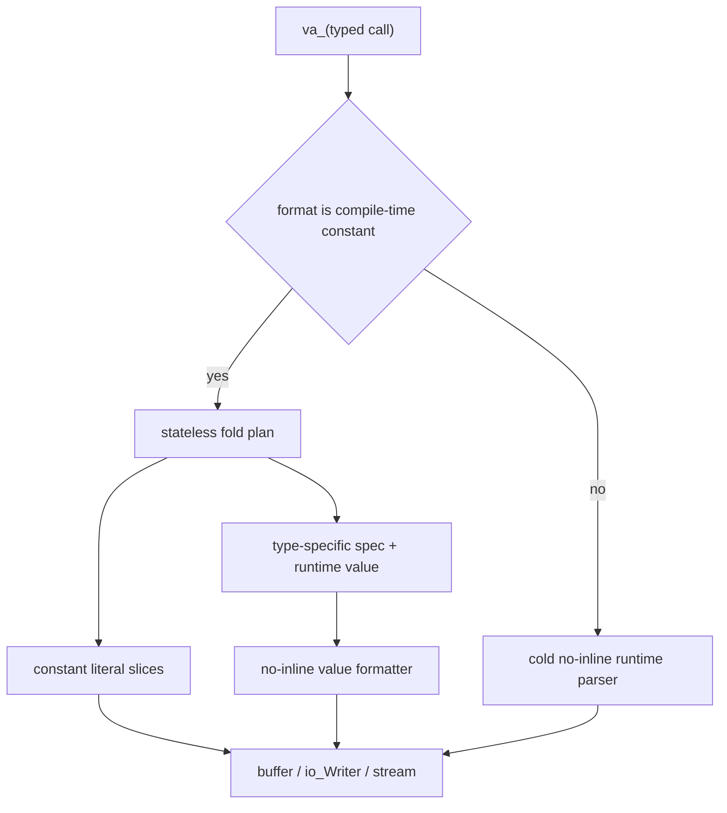
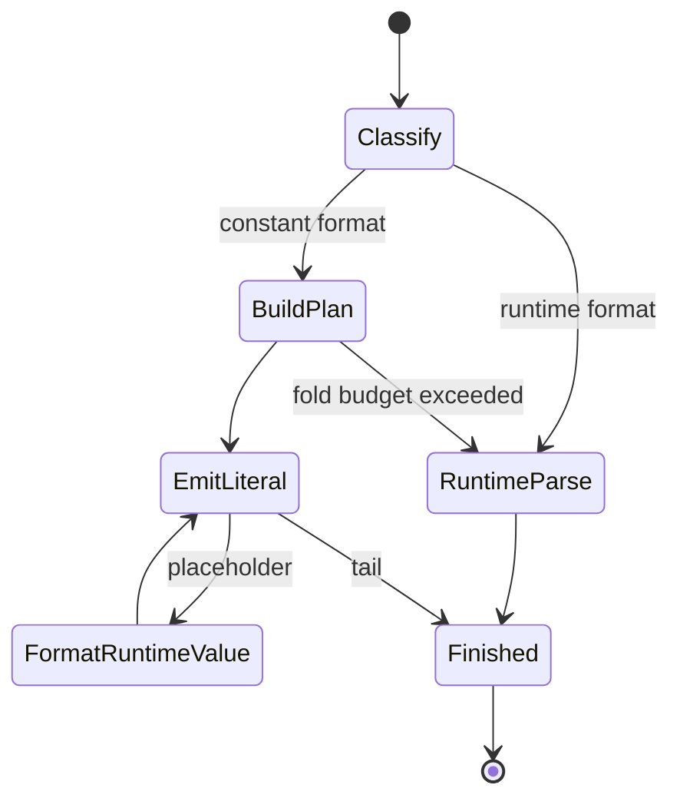
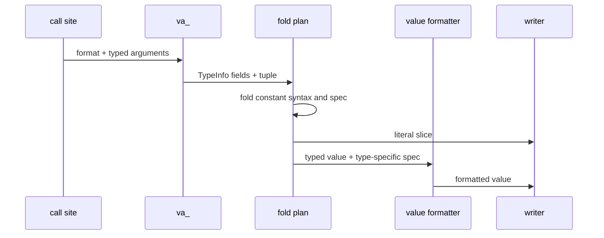

# Foldable formatter replacement proof

## Scope

This proof is intentionally contained in `draft-fmt-foldable-full.c`. It
defines the replacement contract for the existing C `va_list` formatter,
`io_Writer_print`, and `io_stream_print` paths without changing production
headers or sources before approval.

## Architecture



The constant plan is built before any writer callback. A callback therefore
cannot alias mutable parser state and prevent constant propagation. After
optimization, the plan and parser disappear; only literal writes, runtime
value formatting, and actual IO calls remain.





## Type-specific specifications

`fmt_Spec` is a tagged union of specifications whose fields are valid for the
selected value category.

| Value category | Specification | Available options |
| --- | --- | --- |
| void | `fmt_Spec_void` | none |
| bool | `fmt_BoolSpec` | layout, case |
| unsigned integer | `fmt_UIntSpec` | layout, radix, case, alternate form |
| signed integer | `fmt_IIntSpec` | layout, radix, case, sign, alternate form |
| float | `fmt_FltSpec` | layout, mode, case, sign, alternate form, precision |
| pointer | `fmt_PtrSpec` | layout, case, alternate form |
| ASCII / UTF-8 codepoint | `fmt_CharSpec` | layout |
| zero-terminated / sliced string | `fmt_StrSpec` | layout |
| error | `fmt_ErrSpec` | layout |

Integer specifications have no precision member. Parsed formats such as
`%{i:.2}` return `fmt_InvalidTypeSpec` rather than ignoring precision.

The direct typed API covers `Void`, `bool`, every supported signed and unsigned
integer width, `f32`, `f64`, pointers, ASCII, UTF-8 codepoints, zero-terminated
strings, sliced strings, and errors.

## Execution state

| task_id | parent_step | depends_on | deliverable | acceptance_criteria | status |
| --- | --- | --- | --- | --- | --- |
| FMT-1 | Define replacement contract | none | type-specific spec model | invalid cross-type options are unrepresentable or rejected | done |
| FMT-2 | Implement constant path | FMT-1 | stateless fold plan | optimized constant calls contain no parser calls | done |
| FMT-3 | Implement runtime path | FMT-1 | cold no-inline fallback | runtime formats retain one fallback call | done |
| FMT-4 | Integrate IO surfaces | FMT-2, FMT-3 | typed buffer, writer, and stream paths | all calls use `va_`, not C `va_list` | done |
| FMT-5 | Verify replacement proof | FMT-4 | functional and disassembly evidence | output and optimized boundaries match the contract | done |

## Verification

Build and generate clean disassembly:

```text
dh-c build optimize dh/lab/drafts/draft-fmt-foldable-full.c --link-stdlib=off --link=msvcrt --output=dh/lab/drafts/build/verification/draft-fmt-foldable-full --emit-disasm=dh/lab/drafts/build/verification/draft-fmt-foldable-full.dasm --disasm-source=off --disasm-line-numbers=off
```

Observed optimized boundaries:

- `fmt_test_constantBuffer` contains `fmt_printU64` but no scan, spec parser,
  `fmt_printRuntime`, or `fmt_writeRuntime` call.
- `fmt_test_constantWriter` contains only value formatting,
  `fmt__writerWritePadded`, and `fmt__writerWriteAll` calls.
- `fmt_test_constantStream` contains only value formatting and writer calls.
- `fmt_test_runtimeBuffer` contains one `fmt_printRuntime` call.
- `fmt_test_runtimeWriter` contains one `fmt_writeRuntime` call, which enters
  `fmt__writeRuntimeFrom`.
- The optimized executable completes with exit code `0`; its assertions cover
  buffer output, writer output, stream execution, runtime-format output,
  indexed and wrapped arguments, type-specific direct formatting, float
  precision, rejection of integer precision, and a 280-byte string padded to a
  300-byte field without a whole-message or fixed-size string staging buffer.
