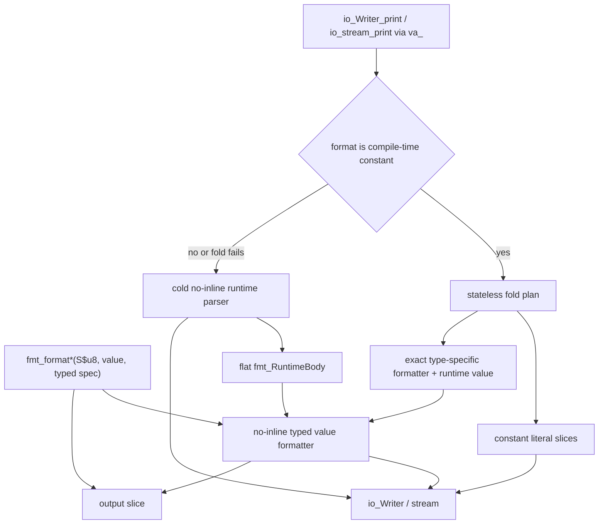
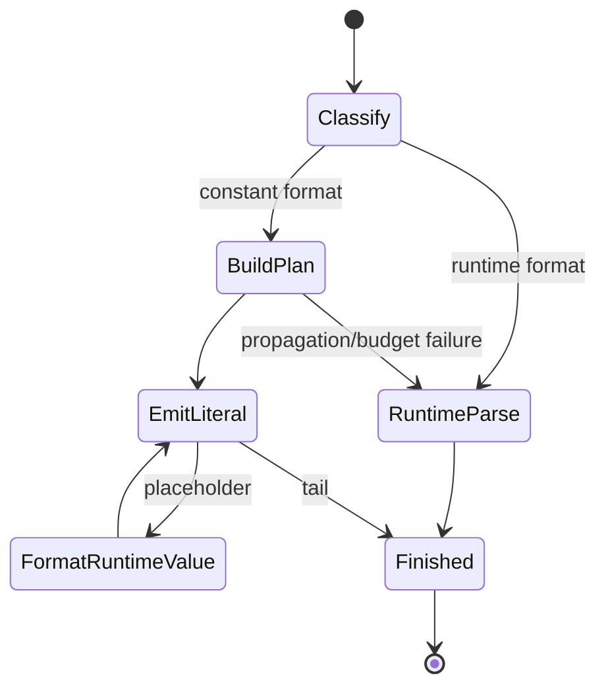
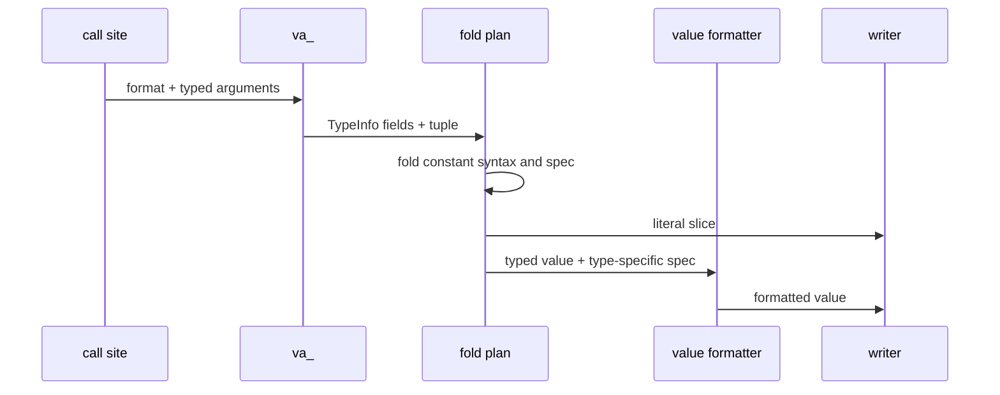

# Foldable formatter replacement proof

## Scope

This proof is intentionally contained in `draft-fmt-foldable-full.c`. It
defines the replacement contract for the existing C `va_list`
`io_Writer_print` and `io_stream_print` paths without changing production
headers or sources before approval. Slice-based `fmt_format*` remains the
text-conversion layer corresponding to `fmt_parse*`; Writer and stream
composition is exposed as `print`, not `format`.

## Architecture



The constant plan is built before any writer callback. A callback therefore
cannot alias mutable parser state and prevent constant propagation. After
optimization, the plan, parser, option selection, and type selection
disappear; only literal writes, exact typed runtime-value formatting, and
actual IO calls remain.

The runtime tuple accepts up to 16 arguments, matching the current formatter
contract. Forced compile-time expansion is capped at 17 plan steps and a
32-byte scan per step. Each call expands only
`min(17, argument_count + ceil(format_length / 32) + 1)` steps. Literal text
longer than 32 bytes is represented as consecutive constant slices.
Placeholder bodies use the same 32-byte compile-time scan budget. A runtime
format, or a constant format whose plan cannot be proven inside this budget,
enters the same cold no-inline fallback. The fallback is the deliberate
code-growth boundary: failed propagation leaves one call instead of an
inlined generic parser and type matrix.





## Type-specific specifications

`fmt_Spec` is a tagged union of specifications whose fields are valid for the
selected value category.

| Value category | Specification | Available options |
| --- | --- | --- |
| void | `fmt_Spec_void` | none |
| bool | `fmt_BoolSpec` | layout, case |
| unsigned integer | `fmt_UIntSpec` | layout and one typed decimal/binary/octal/hex style |
| signed integer | `fmt_IIntSpec` | layout, sign, and one typed decimal/binary/octal/hex style |
| float | `fmt_FltSpec` | layout, sign, optional precision, and one typed decimal/scientific style |
| pointer | `fmt_PtrSpec` | layout, case, alternate form |
| ASCII / UTF-8 codepoint | `fmt_CharSpec` | layout |
| zero-terminated / sliced string | `fmt_StrSpec` | layout |
| error | `fmt_ErrSpec` | layout |

Integer specifications have no precision member. Case and alternate form exist
only inside styles where they change output: hex owns case and alternate form,
binary owns an optional lower/upper prefix, octal owns only alternate form, and
decimal owns neither. Float case exists only in scientific style. Parsed
formats such as `%{i:.2}`, `%{U}`, `%{u(#d)}`, `%{I(o)}`, and `%{F64}` return
`fmt_InvalidTypeSpec` rather than silently ignoring an option. `%{0:>2}` is
also rejected because void has no layout options.

The slice-based `fmt_format*` API covers `Void`, `bool`, every supported signed
and unsigned integer width, `f32`, `f64`, pointers, ASCII, UTF-8 codepoints,
zero-terminated strings, sliced strings, and errors. `io_Writer_print*` and
`io_stream_print*` consume compile-time format strings and typed `va_` tuples.

## Execution state

| task_id | parent_step | depends_on | deliverable | acceptance_criteria | status |
| --- | --- | --- | --- | --- | --- |
| FMT-1 | Define replacement contract | none | type-specific spec model | invalid cross-type options are unrepresentable or rejected | done |
| FMT-2 | Implement constant path | FMT-1 | stateless fold plan | optimized constant calls contain no parser calls | review |
| FMT-3 | Implement runtime path | FMT-1 | cold no-inline fallback | runtime formats retain one fallback call | done |
| FMT-4 | Integrate API layers | FMT-2, FMT-3 | slice format and Writer/stream print paths | naming and ownership match the format/parse and print/scan boundary | review |
| FMT-5 | Verify replacement proof | FMT-4 | functional, compile-time, and disassembly evidence | output, build cost, and optimized boundaries match the contract | blocked |

## Verification

Build and generate clean disassembly through `dh-c` only:

```text
dh-c build optimize dh/lab/drafts/draft-fmt-foldable-full.c --lto=off --link-stdlib=off --link=msvcrt --emit-disasm=dh/lab/drafts/draft-fmt-foldable-full.disasm
```

Observed optimized boundaries:

- The executable completes with exit code `0`, and constant and runtime tests
  are separated into `fmt_test_constantPaths` and `fmt_test_runtimePaths`.
- The linked proof is 4,940 disassembly lines. The constant observation
  function occupies 1,394 lines, from its symbol through the runtime
  observation symbol.
- A clean `dh-c` translation-unit build with link and disassembly generation
  took about 30.00 seconds and emitted 20 failed-unroll warnings.
- The call-site format gate and per-argument constant classification now run
  before tuple values are converted to `u_P_const$raw`.
- These measurements do not meet the replacement contract. In particular,
  Writer/stream typed staging duplicates the fold parser, compile time remains
  excessive, and the constant observation function remains above the intended
  code-size boundary. FMT-2 and FMT-4 therefore require redesign before FMT-5
  can resume.
