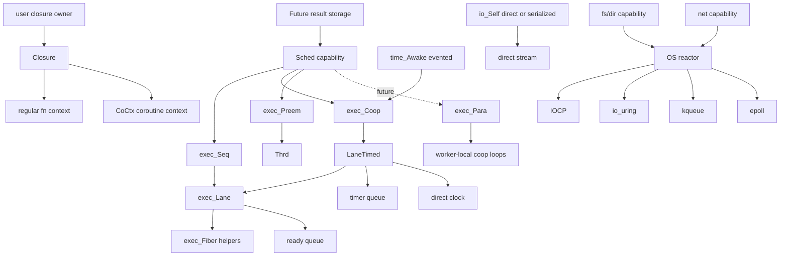
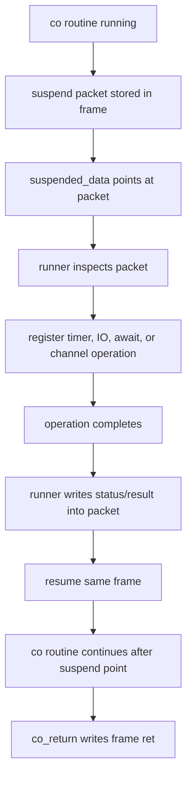
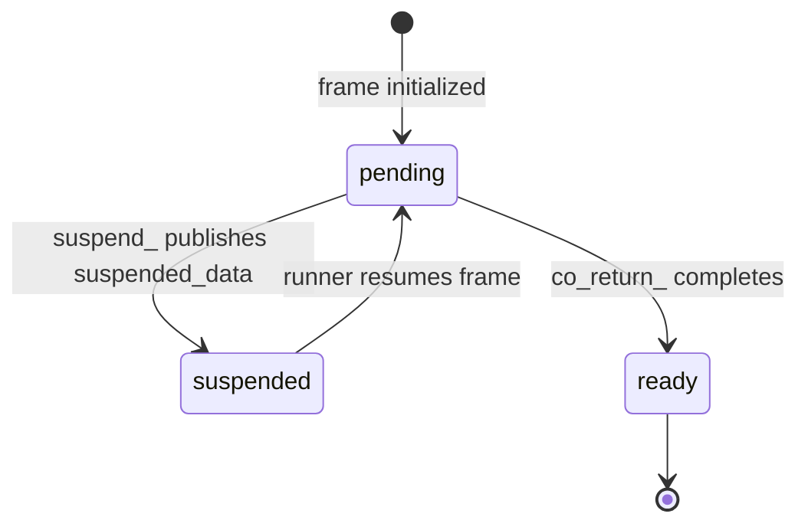
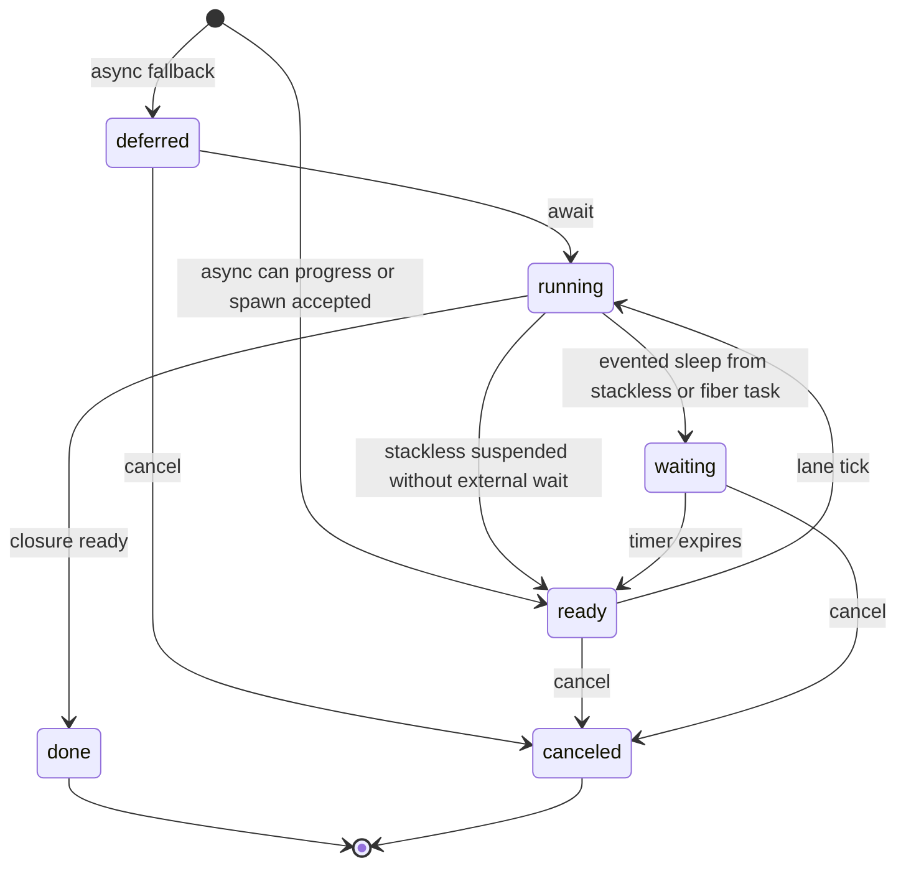
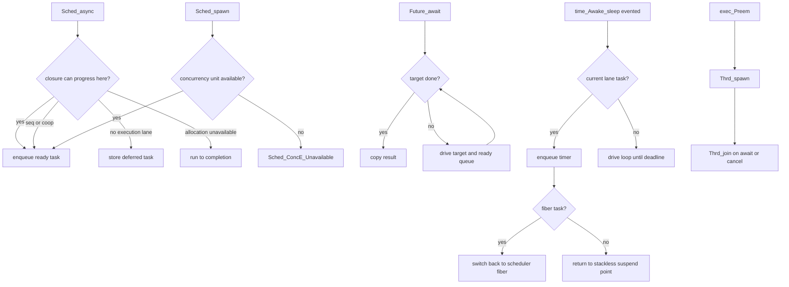

# io_conc Runtime Shape

## Big Picture

`Closure` erases regular function and coroutine invocation. It does not own
result storage or coroutine state. `Future` owns result storage. `CoCtx` owns
coroutine state. `Sched` decides when a closure receives progress.

`exec_Lane` is the shared single-lane task runner core. It owns task
allocation, current task tracking, the ready queue, scheduler fiber context,
and fiber-backed regular function task contexts. It can progress stackless `Co`
closures by one step and fiber-backed regular function closures by switching
onto the task stack.

`exec_LaneTimed` is the timed extension over a lane. It owns `exec_Lane`,
the clock capability, and the timer queue, and provides timed drive
operations such as `run`, `runUntil`, and timer wakeup.

`exec_Seq` is the sequential scheduler owner around `exec_Lane`. It exposes the
sequential `Sched` capability boundary, but it does not own timed wakeup state.
Tasks running under `exec_Seq` must complete without entering external
`waiting` state.

`exec_Coop` is the cooperative scheduler owner around `exec_LaneTimed`. It
exposes explicit `run`, `runUntil`, `task`, and `yield` operations for callers
that want to drive a cooperative loop directly.

`exec_Lane` and `exec_LaneTimed` remain public concrete substrates so
third-party runtimes and future `exec_Para` worker loops can reuse the same
task progression and timed wakeup machinery.

`time_eventedAwake(exec_Coop*)` turns `time_Awake_sleep` into evented
suspension for both stackless and fiber task kinds on the built-in cooperative
runtime. The built-in timed execution model belongs to `exec_Coop`, not
`exec_Seq`.

`exec_Preem` is the OS-thread preemptive scheduler. It uses non-draft `Thrd` for
async progress and explicit spawn. It does not own a cooperative event loop.

`exec_Para` is reserved for a future parallel cooperative scheduler. It is not
declared until its backend exists.

OS polling backends are not part of `Sched` itself. IOCP, io_uring, kqueue, and
epoll belong under a reactor/poller backend that fs, dir, net, process, and
cooperative time adapters can share. They should be introduced when those
capabilities need real pending OS operations, not as a new God Object surface.

## Stackless Coroutine Primitive Contract

`Co` is treated as a complete low-level stackless coroutine primitive. It owns
the frame layout, state counter, return slot, argument slot, persistent local
storage, mutable local storage, and suspend payload storage needed to lower a
function into a resumable state machine.

This completion boundary is intentionally below the scheduler. `Co` does not
know about time, IO, futures, cancellation, threads, or OS pollers. It only
provides these operations:

- create a typed frame through a closure constructor
- resume the frame until it returns or suspends
- store the final return value in the frame return slot
- expose suspend payload data to the runner through `suspended_data`

`suspend_` is a statement-level effect handoff, not a required expression-level
result channel. A coroutine sends one typed suspend packet to the runner by
storing it in its own frame storage and publishing its address through
`suspended_data`. `resume_` only needs the frame; any completion value for an
operation is written into the packet or result cell referenced by the suspend
payload before the task is resumed.

This makes `suspended_data` a one-shot control channel between the coroutine and
the selected runner. It is deliberately not a general multi-producer or
multi-consumer channel. Higher-level `Future`, `Sched`, timer, IO, select, join,
or quorum behavior is built by interpreting the suspend packet and choosing
when to resume the frame.

Typed suspend packets are preferred over forcing a type-erased `resume` value.
This keeps the primitive small, keeps type erasure at the runtime boundary that
needs it, and allows single-threaded cooperative runners to avoid unnecessary
atomic or virtual-dispatch policy inside the coroutine frame.

`invoke_` is the erased closure routine dispatch and executes the selected
routine once. Completion policy belongs above it:

- `exec_invokeToStep` dispatches once and returns a result pointer only when the
  closure is complete
- `exec_invokeToCompletion` repeats step dispatch until a result is available
- schedulers use step dispatch for stackless cooperative tasks and copy the
  returned result into the task-owned result slot
- fiber and preemptive workers use completion dispatch and then copy the final
  result into the task-owned result slot

## Task States

## Flow

`async` may create concurrency when the selected scheduler can do so. It is not
a hard guarantee. `spawn` is the hard concurrency request and reports
`Unavailable` instead of silently falling back.

## Constructor Rule

Capability constructors belong to the capability namespace and name the selected
backend:

- `Sched_seq(exec_Seq*)`
- `Sched_coop(exec_Coop*)`
- `Sched_preem(exec_Preem*)`
- `time_directAwake(void)`
- `time_eventedAwake(exec_Coop*)`
- `io_direct(void)`

Backend constructors only create backend state, such as
`exec_Seq_init(gpa)`, `exec_Coop_init(gpa, clock)`, and `exec_Preem_init`.
Backend modules do not expose
`exec_<Backend>_<capability>` getters.

A constructor is declared only when that backend really implements the
capability. `io_coop` stays absent until serialized stream queuing is part of
`exec_Coop`; `io_seq` and `io_preem` are not separate constructors while they
would only alias direct stream output.

## Reserved `Sched_para` Contract

`Sched_para(exec_Para*)` is reserved for a backend that provides parallel
cooperative scheduling. It should not be declared until the backend can satisfy
these rules:

- it owns multiple execution lanes backed by worker threads
- each lane can progress cooperative tasks instead of dedicating one OS thread
  per spawned closure
- `spawn` creates a concurrency unit by enqueueing the closure onto a worker or
  shared injection queue
- `async` may enqueue when progress is available, or complete/defer according to
  the general `Sched_async` contract
- `await` drives the caller lane and may help with ready work until the target
  future is done or canceled
- `time_Awake_sleep` and future serialized IO integrate with worker-local or shared
  cooperative queues, not direct blocking per task
- cancellation is cooperative for queued/suspended tasks and does not require
  unsafe thread termination

`Sched_para` is therefore not an alias for `Sched_preem`. `exec_Preem` delegates
scheduling to OS threads; `exec_Para` must own a parallel cooperative runtime.

Current `exec_Seq` and `exec_Coop` accept `spawn` for stackless `Co` closures and
fiber-backed regular function closures. Fiber-backed functions run on a separate
stack; they become cooperatively interruptible once a capability, such as
cooperative time or IO, switches back to the scheduler from inside that fiber.
