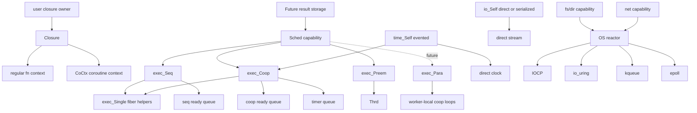
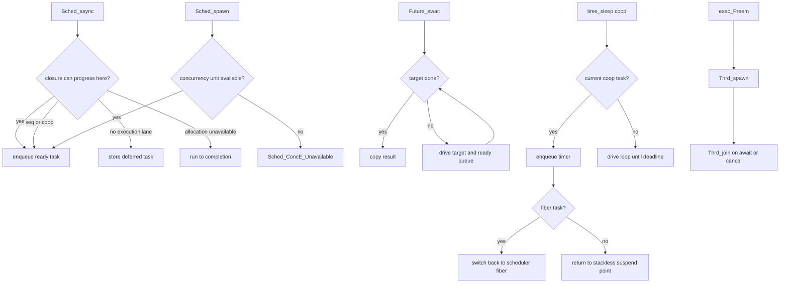

# io_conc Runtime Shape

## Big Picture

`Closure` erases regular function and coroutine invocation. It does not own
result storage or coroutine state. `Future` owns result storage. `CoCtx` owns
coroutine state. `Sched` decides when a closure receives progress.

`exec_Seq` is the single-lane sequential scheduler. It progresses stackless
`Co` closures directly through its ready queue and regular function closures
through `exec_Single` fiber task contexts.

`exec_Coop` is the single-lane cooperative scheduler. It owns ready and timer
queues. It uses the same stackless and fiber task kinds as `exec_Seq`, and
`time_evented` turns `time_sleep` into evented suspension for both task kinds.

`exec_Preem` is the OS-thread preemptive scheduler. It uses non-draft `Thrd` for
async progress and explicit spawn. It does not own a cooperative event loop.

`exec_Para` is reserved for a future parallel cooperative scheduler. It is not
declared until its backend exists.

OS polling backends are not part of `Sched` itself. IOCP, io_uring, kqueue, and
epoll belong under a reactor/poller backend that fs, dir, net, process, and
cooperative time adapters can share. They should be introduced when those
capabilities need real pending OS operations, not as a new God Object surface.

## Task States

## Flow

`async` may create concurrency when the selected scheduler can do so. It is not
a hard guarantee. `spawn` is the hard concurrency request and reports
`Unavailable` instead of silently falling back.

## Constructor Rule

Capability constructors belong to the capability namespace and name the selected
backend:

- `Sched_seq(exec_Seq*)`
- `Sched_coop(exec_Coop*)`
- `Sched_preem(exec_Preem*)`
- `time_direct(void)`
- `time_evented(exec_Coop*)`
- `io_direct(void)`

Backend constructors only create backend state, such as `exec_Seq_init`,
`exec_Coop_init`, and `exec_Preem_init`. Backend modules do not expose
`exec_<Backend>_<capability>` getters.

A constructor is declared only when that backend really implements the
capability. `io_coop` stays absent until serialized stream queuing is part of
`exec_Coop`; `io_seq` and `io_preem` are not separate constructors while they
would only alias direct stream output.

## Reserved `Sched_para` Contract

`Sched_para(exec_Para*)` is reserved for a backend that provides parallel
cooperative scheduling. It should not be declared until the backend can satisfy
these rules:

- it owns multiple execution lanes backed by worker threads
- each lane can progress cooperative tasks instead of dedicating one OS thread
  per spawned closure
- `spawn` creates a concurrency unit by enqueueing the closure onto a worker or
  shared injection queue
- `async` may enqueue when progress is available, or complete/defer according to
  the general `Sched_async` contract
- `await` drives the caller lane and may help with ready work until the target
  future is done or canceled
- `time_sleep` and future serialized IO integrate with worker-local or shared
  cooperative queues, not direct blocking per task
- cancellation is cooperative for queued/suspended tasks and does not require
  unsafe thread termination

`Sched_para` is therefore not an alias for `Sched_preem`. `exec_Preem` delegates
scheduling to OS threads; `exec_Para` must own a parallel cooperative runtime.

Current `exec_Seq` and `exec_Coop` accept `spawn` for stackless `Co` closures and
fiber-backed regular function closures. Fiber-backed functions run on a separate
stack; they become cooperatively interruptible once a capability, such as
cooperative time or IO, switches back to the scheduler from inside that fiber.
