# io_conc Runtime Shape

## Big Picture

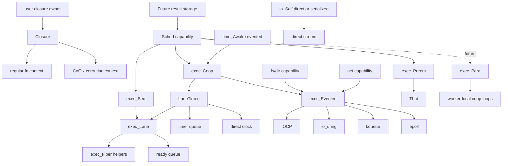

`Closure` erases regular function and coroutine invocation. It does not own
result storage or coroutine state. `Future` owns result storage. `CoCtx` owns
coroutine state. `Sched` decides when a closure receives progress.

`exec_Lane` is the shared single-lane task runner core. It owns task
allocation, current task tracking, the ready queue, scheduler fiber context,
and fiber-backed regular function task contexts. It can progress stackless `Co`
closures by one step and fiber-backed regular function closures by switching
onto the task stack.

`exec_LaneTimed` is the timed extension over a lane. It owns `exec_Lane`,
the clock capability, and the timer queue, and provides timed drive
operations such as `run`, `runUntil`, and timer wakeup.

`exec_Seq` is the sequential scheduler owner around `exec_Lane`. It exposes the
sequential `Sched` capability boundary, but it does not own timed wakeup state.
Tasks running under `exec_Seq` must complete without entering external
`waiting` state.

`exec_Coop` is the cooperative scheduler owner around `exec_LaneTimed`. It
exposes explicit `run`, `runUntil`, `task`, and `yield` operations for callers
that want to drive a cooperative loop directly.

`exec_Lane` and `exec_LaneTimed` remain public concrete substrates so
third-party runtimes and future `exec_Para` worker loops can reuse the same
task progression and timed wakeup machinery.

`time_Awake_evented(exec_Coop*)` turns `time_Awake_sleep` into evented
suspension for both stackless and fiber task kinds on the built-in cooperative
runtime. The built-in timed execution model belongs to `exec_Coop`, not
`exec_Seq`.

`exec_Preem` is the OS-thread preemptive scheduler. It uses non-draft `Thrd` for
async progress and explicit spawn. It does not own a cooperative event loop.

`exec_Para` is reserved for a future parallel cooperative scheduler. It is not
declared until its backend exists.

OS polling backends are not part of `Sched` itself. IOCP, io_uring, kqueue, and
epoll belong under `exec_Evented`, which `exec_Coop` may own and drive. The
capability modules use that substrate through `fs_evented`, `net_evented`, and
`io_evented` instead of growing a God Object surface.

## IO Shape

`io_Reader` and `io_Writer` stay as the single stream interfaces. The design
does not split them into blocking and nonblocking, or synchronous and
asynchronous variants. A read or write is one operation surface; whether it
blocks the current thread, suspends the current task, or is offloaded to a
worker is decided by the concrete owner and the selected execution backend.

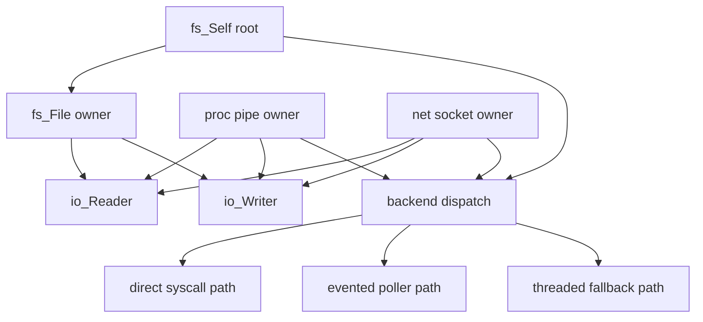

The concrete owner is where runtime awareness lives. The stream interface is
only the projector.

- `io_Reader` and `io_Writer` remain small erased capabilities.
- `fs_File` and `fs_Dir` keep only handle-local state. `fs_Self` is passed to
  backend-sensitive operations and supplies the dispatch policy.
- public `fs_File_Reader` and `fs_File_Writer` values hold the stream
  projection state in caller-owned storage. `io_Reader` and `io_Writer` only
  borrow that storage through their `ctx` pointer.
- buffered adapters such as `io_Buf_Reader` and `io_Buf_Writer` stay layered on
  top of these same interfaces.

This is the main difference from Zig's `Io` root design. Zig centralizes the
backend in the `Io` object and routes every operation through that root. In
this codebase, root dispatch is split by module. `fs_Self` is the filesystem
root, while `io_Reader` and `io_Writer` remain stream interfaces.

### Concrete Owner Contract

The first implementation target is `fs_File`, because it already exists in the
main codebase and already projects `io_Reader` and `io_Writer`.

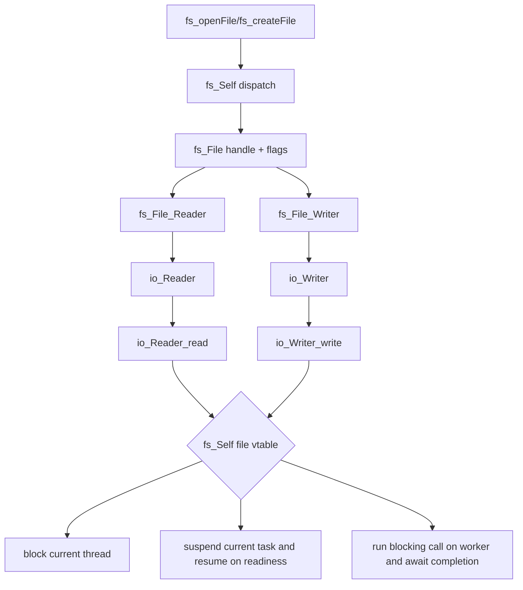

Concrete owner requirements:

- the owner stores OS handle and handle-local flags only
- the module root capability is passed as an operation parameter and defines
  how filesystem operations are dispatched
- the owner may also store operational flags such as `nonblocking`
- projector functions do not choose policy; they expose caller-owned
  `fs_File_Reader`/`fs_File_Writer` storage through `io_Reader`/`io_Writer`
- cancellation and `WouldBlock` behavior belong to the owner/root contract,
  not to a second reader or writer type

## FS Shape

`File`, `Dir`, and `path` should follow Zig's split of responsibility, but not
its `Io` God Object root.

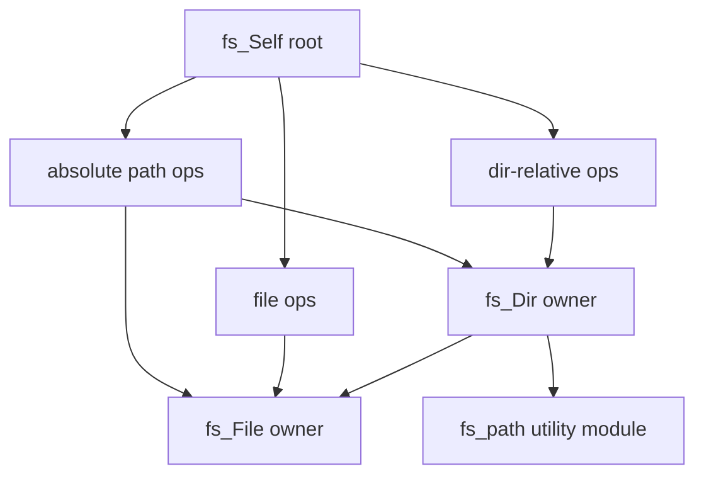

- `fs_Self` is the explicit filesystem root capability. Zig carries this role
  inside `Io`; here it should be split out as the filesystem root and passed to
  backend-sensitive operations.
- `fs_Self` has three dispatch groups: absolute path operations, file handle
  operations, and directory-relative operations. This keeps `fs_File` and
  `fs_Dir` thin while still allowing third-party filesystem backends.
- `fs_File` is the file handle owner. It carries file-open state and stream
  projection.
- `fs_Dir` is the directory handle owner. It carries directory-relative
  operations such as `openFile`, `createFile`, `openDir`, `rename`,
  `makePath`, and `realpath`.
- `fs_path` is not a handle owner. It is a pure path utility surface for join,
  split, normalize, basename, dirname, extension, and absolute/relative path
  transformations.

This matches Zig's effective split:

- `Io.File`: handle owner plus operation flags
- `Io.Dir`: directory owner plus path-relative open/create/traversal APIs
- `Dir.path = std.fs.path`: path utilities are not part of `File`

In this codebase the equivalent should be:

- `fs/Self.h`: filesystem root capability and absolute-path entry points
- `fs/File.h`: file owner and stream projection
- `fs/Dir.h`: directory owner and directory-relative mutation/open APIs
- `fs/path.h`: pure path utilities

The current main codebase only has `File` and `Dir`. The `path` surface is
still embedded in `Dir` through `makePath` and `realpath*`. Draft work should
first define `fs_Self` as the root entry surface, then split reusable
path-only logic into `fs/path.*`.

### `fs_File`

`fs_File` should evolve from bare handle storage to an owner that keeps only
file-local state.

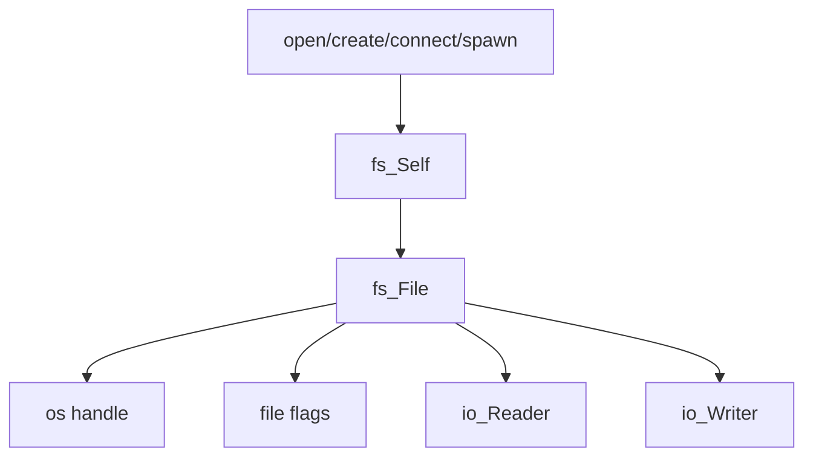

Target shape:

- `handle`
- `flags`
  - at minimum `nonblocking`

`fs_File_Reader` and `fs_File_Writer` are public storage types because the
erased `io_Reader`/`io_Writer` `ctx` pointer must outlive the returned
interface value. Creating the erased interface from a temporary object is
invalid.

### `fs_Dir`

`fs_Dir` should keep only directory-local state. `fs_Self` belongs at the root
entry boundary and is passed to backend-sensitive operations rather than stored
inside every directory handle. Directory operations are still path-relative and
handle-based.

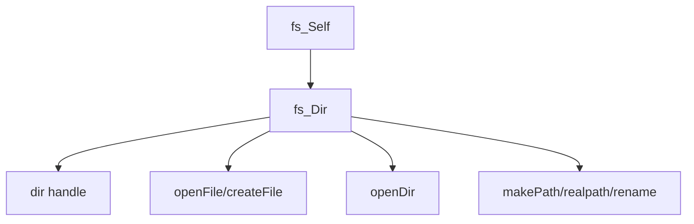

This also resolves the current asymmetry where `fs_File` would become runtime
aware but `fs_Dir` would still be a passive handle shell.

### `fs_path`

`fs_path` should be a utility module, not a capability owner.

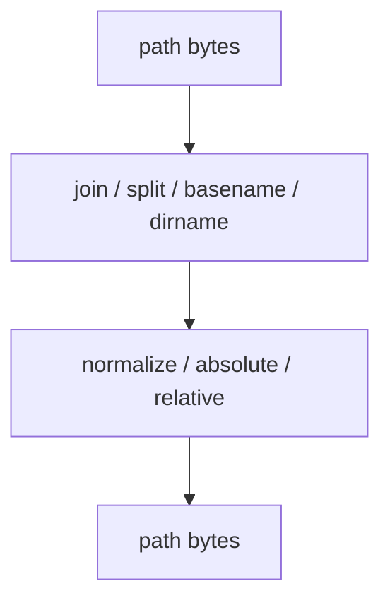

Rules:

- no OS handle ownership
- no scheduler ownership
- no direct async behavior
- pure byte-path or platform-path transformation helpers only

`realpath` does not belong to `fs_path`; it belongs to `fs_Dir` or `fs_File`
because it requires filesystem resolution through a live backend.

## IO Backend Boundary

The current draft `io_Self` is a small stream-printing capability for stdout
and stderr. It is not the right home for IOCP, io_uring, kqueue, or epoll.

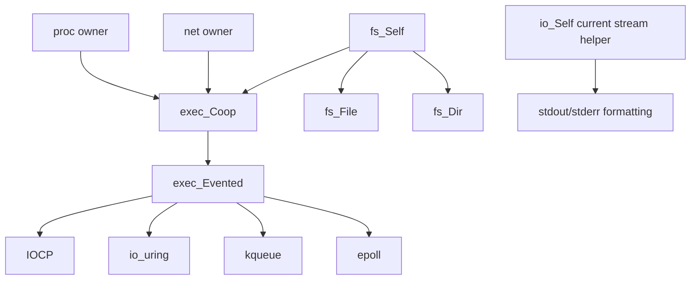

So the answer is no: OS polling backends should not be bolted onto the current
`io_Self` surface.

The right boundary is `exec_Evented`, owned and driven by `exec_Coop`. For
filesystem operations, `fs_evented(exec_Coop*)` selects that backend and
`fs_Self` is passed into backend-sensitive operations. The current `io_Self`
should remain the small stream helper unless it is explicitly renamed and
widened later.

Practical consequence:

- keep current `io_Self` for output/formatting stream helpers
- keep `exec_Evented` as the separate backend substrate for evented operations
- `fs_Self`, future `proc_Self`, and `net_Self` select that substrate through
  `exec_Coop`
- IOCP, io_uring, kqueue, and epoll live under that substrate, not under the
  current `io_Self`

### Implementation Order

1. make draft `fs_Self` the filesystem root dispatch surface
2. route `fs_File` and `fs_Dir` operations through `fs_Self`
3. split reusable pure path helpers into `fs/path.*`
4. route `io_Reader`/`io_Writer` projectors through `fs_Self` file dispatch
5. preserve existing buffered adapters unchanged
6. add evented IO backend substrate below module roots
7. add `proc` pipe owners on the same pattern
8. add `net` stream/socket owners on the same pattern

## Stackless Coroutine Primitive Contract

`Co` is treated as a complete low-level stackless coroutine primitive. It owns
the frame layout, state counter, return slot, argument slot, persistent local
storage, mutable local storage, and suspend payload storage needed to lower a
function into a resumable state machine.

This completion boundary is intentionally below the scheduler. `Co` does not
know about time, IO, futures, cancellation, threads, or OS pollers. It only
provides these operations:

- create a typed frame through a closure constructor
- resume the frame until it returns or suspends
- store the final return value in the frame return slot
- expose suspend payload data to the runner through `suspended_data`

`suspend_` is a statement-level effect handoff, not a required expression-level
result channel. A coroutine sends one typed suspend packet to the runner by
storing it in its own frame storage and publishing its address through
`suspended_data`. `resume_` only needs the frame; any completion value for an
operation is written into the packet or result cell referenced by the suspend
payload before the task is resumed.

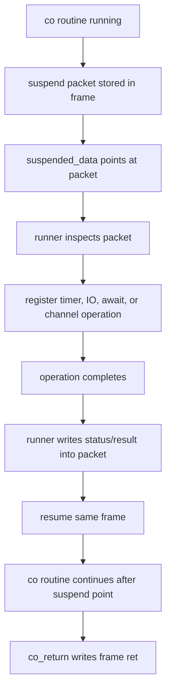

This makes `suspended_data` a one-shot control channel between the coroutine and
the selected runner. It is deliberately not a general multi-producer or
multi-consumer channel. Higher-level `Future`, `Sched`, timer, IO, select, join,
or quorum behavior is built by interpreting the suspend packet and choosing
when to resume the frame.

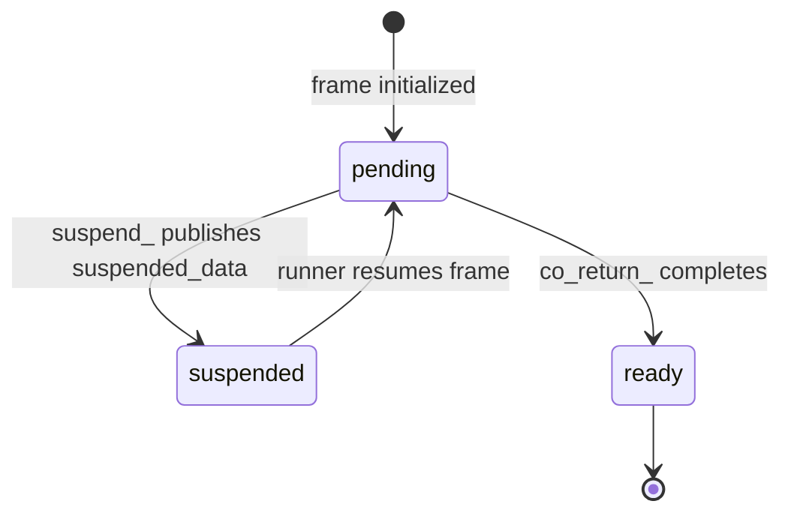

Typed suspend packets are preferred over forcing a type-erased `resume` value.
This keeps the primitive small, keeps type erasure at the runtime boundary that
needs it, and allows single-threaded cooperative runners to avoid unnecessary
atomic or virtual-dispatch policy inside the coroutine frame.

`invoke_` is the erased closure routine dispatch and executes the selected
routine once. Completion policy belongs above it:

- `exec_invokeToStep` dispatches once and returns a result pointer only when the
  closure is complete
- `exec_invokeToCompletion` repeats step dispatch until a result is available
- schedulers use step dispatch for stackless cooperative tasks and copy the
  returned result into the task-owned result slot
- fiber and preemptive workers use completion dispatch and then copy the final
  result into the task-owned result slot

## Task States

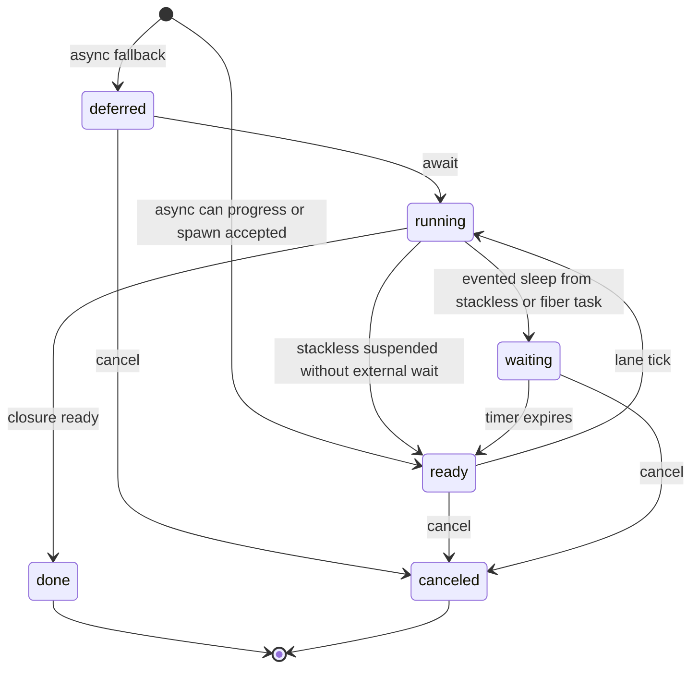

## Flow

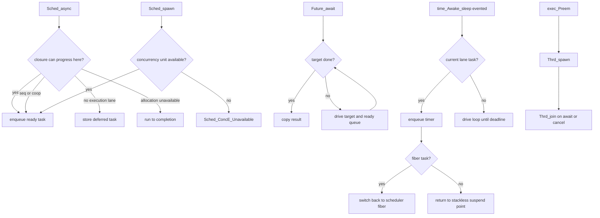

`async` may create concurrency when the selected scheduler can do so. It is not
a hard guarantee. `spawn` is the hard concurrency request and reports
`Unavailable` instead of silently falling back.

## Constructor Rule

Capability constructors belong to the capability namespace and name the selected
backend:

- `Sched_seq(exec_Seq*)`
- `Sched_coop(exec_Coop*)`
- `Sched_preem(exec_Preem*)`
- `time_Awake_direct(void)`
- `time_Awake_evented(exec_Coop*)`
- `fs_direct(void)`
- `fs_evented(exec_Coop*)`
- `io_direct(void)`
- `io_evented(exec_Coop*)`
- `net_direct(void)`
- `net_evented(exec_Coop*)`
- `proc_direct(void)`

Backend constructors only create backend state, such as
`exec_Seq_init(gpa)`, `exec_Coop_init(gpa, clock)`,
`exec_Coop_initEvented(gpa, clock, evented)`, `exec_Evented_Iocp_init`, and
`exec_Preem_init`.
Backend modules do not expose
`exec_<Backend>_<capability>` getters.

A constructor is declared only when that backend really implements the
capability. Evented capability constructors take `exec_Coop*` because `Coop`
owns the event substrate and drives completion polling. `Seq` does not receive
evented capability constructors while it is only a single-lane direct runner.

## Reserved `Sched_para` Contract

`Sched_para(exec_Para*)` is reserved for a backend that provides parallel
cooperative scheduling. It should not be declared until the backend can satisfy
these rules:

- it owns multiple execution lanes backed by worker threads
- each lane can progress cooperative tasks instead of dedicating one OS thread
  per spawned closure
- `spawn` creates a concurrency unit by enqueueing the closure onto a worker or
  shared injection queue
- `async` may enqueue when progress is available, or complete/defer according to
  the general `Sched_async` contract
- `await` drives the caller lane and may help with ready work until the target
  future is done or canceled
- `time_Awake_sleep` and future serialized IO integrate with worker-local or shared
  cooperative queues, not direct blocking per task
- cancellation is cooperative for queued/suspended tasks and does not require
  unsafe thread termination

`Sched_para` is therefore not an alias for `Sched_preem`. `exec_Preem` delegates
scheduling to OS threads; `exec_Para` must own a parallel cooperative runtime.

Current `exec_Seq` and `exec_Coop` accept `spawn` for stackless `Co` closures and
fiber-backed regular function closures. Fiber-backed functions run on a separate
stack; they become cooperatively interruptible once a capability, such as
cooperative time or IO, switches back to the scheduler from inside that fiber.

## Evented Backend Shape

`exec_Evented` is not a new execution model. It is the OS event substrate that
`exec_Coop` may own in addition to `exec_LaneTimed`.

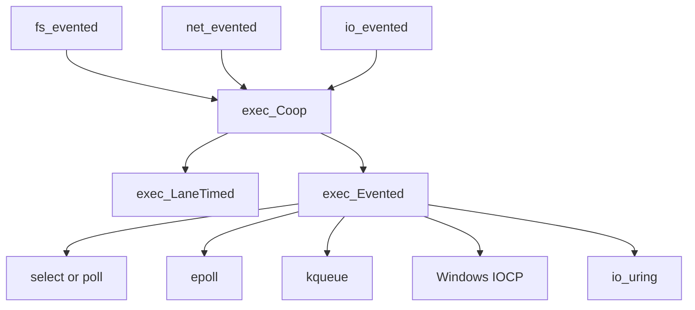

`Seq` remains lane-only. If an operation needs OS event completion, the intended
execution model is `Coop`, because the event backend has useful work only when a
driver can poll completions and resume suspended tasks.

The common evented boundary is completion-oriented:

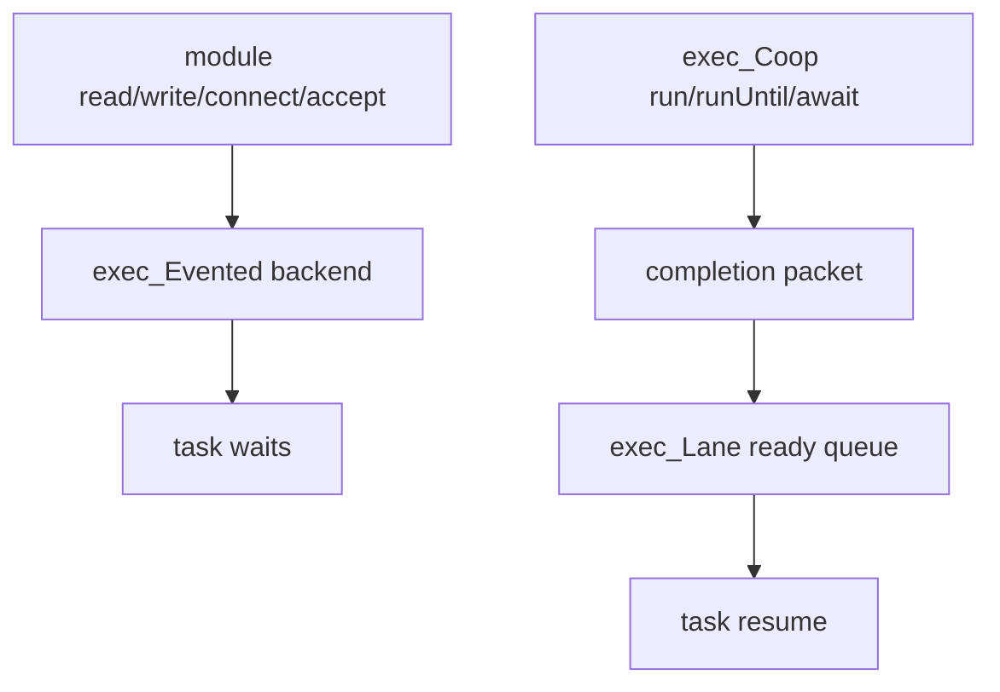

This shape fits IOCP and io_uring directly. Readiness backends such as
select/epoll/kqueue adapt by registering readiness interest and completing the
operation after the handle becomes readable or writable.

`fs_evented`, `net_evented`, and `io_evented` are module adapters over
`exec_Coop`; they do not own IOCP, epoll, kqueue, or io_uring directly.
